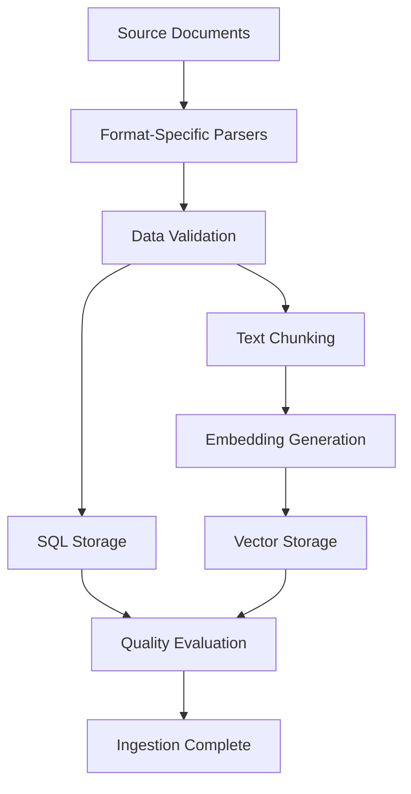
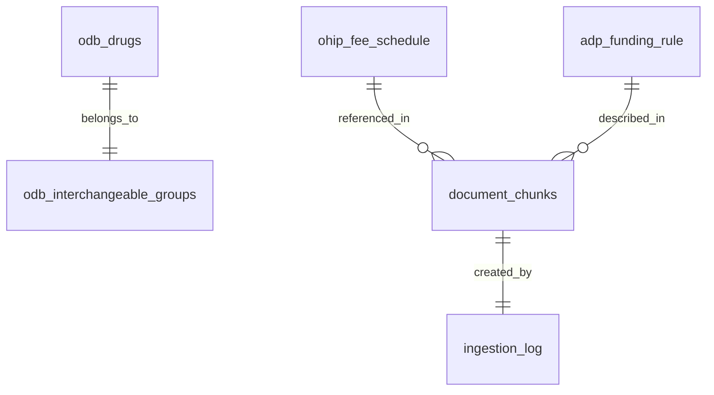

# Dr. OFF: Data Sources & Ingestion Pipeline

This document provides comprehensive details about the data sources, parsing strategies, and ingestion pipelines that power the Dr. OFF agent.

## Data Sources Overview

Dr. OFF integrates three major Ontario healthcare data sources, each requiring specialized parsing and ingestion approaches:

| Source | Data Type | Records | Status | Key Challenge |
|--------|-----------|---------|--------|---------------|
| **ODB** | XML + PDF | 8,401 drugs | ✅ Complete | Interchangeable group calculation |
| **OHIP** | PDF + DOC | 2,123+ fee codes | 🔄 In Progress | Multi-column table extraction |
| **ADP** | PDF Manual | 505 sections | ✅ Complete | LLM-enhanced targeted extraction |

## Extracted Data Files Registry

This section provides a comprehensive mapping of all extracted data files by knowledge area for database restoration and validation purposes.

### ODB (Ontario Drug Benefit) Extractions

#### Source Files
- **Raw XML**: `data/ontario/odb/moh-ontario-drug-benefit-odb-formulary-edition-43-data-extract-en-2025-08-29.xml`
- **Raw PDF**: `data/ontario/odb/odb-formulary-edition-43.pdf`

#### Processed Outputs
- **SQL Database**: `data/ohip.db`
  - Table: `odb_drugs` (8,401 records)
  - Table: `odb_interchangeable_groups` (2,369 records)
- **Vector Store**: `data/processed/dr_off/chroma/` → Collection: `odb_documents`
  - 49 chunks with embeddings from PDF content

#### Re-ingestion Command
```bash
python src/agents/ontario_orchestrator/ingestion/ingesters/odb_ingester.py
```

### OHIP (Ontario Health Insurance Plan) Extractions

#### Source Files
- **Schedule PDF**: `data/ontario/ohip/moh-schedule-benefit-2024-03-04.pdf`
- **Act Document**: `data/ontario/ohip/health-insurance-act.doc`

#### Processed Outputs (Schedule of Benefits)
| Section | Status | Output File | Fee Codes | Size |
|---------|--------|-------------|-----------|------|
| **GP** | ✅ Complete | `data/processed/section_GP_extracted.json` | 113 | ~50KB |
| **A** | ✅ Complete | `data/processed/section_A_extracted.json` | 2,010 | ~850KB |
| **B** | ✅ Complete | `data/processed/section_B_extracted.json` | 105 | ~45KB |
| **C** | 🔄 In Progress | `data/processed/section_C_extracted.json` | ~454 | 741KB |
| **D-H** | 🔄 In Progress | `data/processed/section_D_E_F_G_H_extracted.json` | TBD | TBD |
| **J-M** | 🔄 In Progress | `data/processed/section_J_K_L_M_extracted.json` | TBD | TBD |
| **N-S** | 🔄 In Progress | `data/processed/section_N_P_Q_R_S_extracted.json` | TBD | TBD |
| **T-Z** | 🔄 In Progress | `data/processed/section_T_U_V_W_Y_Z_extracted.json` | TBD | TBD |

#### Processed Outputs (Health Insurance Act)
- **Extracted Data**: `data/processed/act_extraction_v3_full.json` (30 sections with DEFINITIONS)
- **Test Extract**: `data/processed/act_extraction_v3_test.json` (validation subset)

#### Database Storage
- **Primary Database**: `data/ohip.db` (enhanced with multiple tables)
  - `ohip_fee_schedule` (2,123+ fee codes from GP + Section A)
  - `act_eligibility_rule` (58 records)
  - `act_health_card_rule` (11 records)
  - `act_uninsured_reference` (9 records)
  - `act_dependant_carryover` (1 record)
  - `act_status_extension` (1 record)
- **Vector Store**: `data/processed/dr_off/chroma/` → Collection: `ohip_documents` (191 embeddings total)

#### Re-ingestion Commands
```bash
# Extract Schedule sections (enhanced version)
python src/agents/ontario_orchestrator/ingestion/extractors/ohip_extractor.py --sections GP A B

# Ingest to database
python src/agents/ontario_orchestrator/ingestion/ingesters/ohip_ingester.py --init-db --max-subsections 50

# Extract Health Insurance Act
python src/agents/ontario_orchestrator/ingestion/extractors/act_extractor.py

# Ingest Act to database
python src/agents/ontario_orchestrator/ingestion/ingesters/act_ingester.py
```

### ADP (Assistive Devices Program) Extractions

#### Source Files
- **Communication Aids**: `data/ontario/adp/adp-communication-aids-manual.pdf`
- **Mobility Devices**: `data/ontario/adp/adp-mobility-devices-manual.pdf`

#### Processed Outputs
- **LLM-Enhanced Extraction**: `data/processed/dr_off/adp/adp_focused_extraction_llm.json` (505 sections)
- **Targeted Page Ranges**: Parts 2-7 from 11 specialty document types
- **Document Types**: mobility, hearing, insulin pump, prosthesis, respiratory, visual aids, etc.

#### Database Storage
- **Enhanced Database**: `data/ohip.db` (extended with ADP tables)
  - `adp_funding_rule` (735 records) - client share percentages, CEP leasing scenarios
  - `adp_exclusion` (1,101 records) - device limitations and restrictions
- **Vector Store**: `data/processed/dr_off/chroma/` → Collection: `adp_v1` (610 embeddings)

#### Re-ingestion Commands
```bash
# Extract ADP manuals with LLM enhancement
PYTHONPATH=/Users/liammckendry/health_assistant_dr_off_worktree python src/agents/dr_off_agent/ingestion/run_adp_extraction.py

# Ingest to database and vector store  
PYTHONPATH=/Users/liammckendry/health_assistant_dr_off_worktree python src/agents/dr_off_agent/ingestion/run_adp_ingestion.py
```

### Database Files Summary

| Database File | Purpose | Tables | Records | Vector Collections |
|---------------|---------|--------|---------|-------------------|
| `data/ohip.db` | Consolidated database | 15+ tables | 13,000+ | All SQL data |
| `data/processed/dr_off/chroma/` | Vector embeddings | 3 collections | 850 total embeddings | Cross-source semantic search |

### Validation & Quality Files

#### Test Results
- **Assessment Test**: `data/processed/assessment_enhanced_test.json` (GP21 Assessment validation)
- **Surgical Assistants**: `data/processed/surgical_assistants_test.json` (4 target codes verification)

#### Table of Contents
- **OHIP TOC**: `data/processed/toc_extracted.json` (272 entries)
- **Page Ranges**: `data/processed/cleaned_page_ranges.json` (25 main sections)

### Backup & Restoration Procedures

#### Complete System Restore
```bash
# 1. Restore ODB data
python src/agents/ontario_orchestrator/ingestion/ingesters/odb_ingester.py

# 2. Restore OHIP Schedule (completed sections)
python src/agents/ontario_orchestrator/ingestion/ingesters/ohip_ingester.py --sections GP A B

# 3. Restore Health Insurance Act
python src/agents/ontario_orchestrator/ingestion/ingesters/act_ingester.py

# 4. Restore ADP data
python src/agents/ontario_orchestrator/ingestion/ingesters/adp_ingester.py

# 5. Verify data integrity
python src/agents/ontario_orchestrator/ingestion/extractors/quality_evaluator.py --all-sources
```

#### Selective Restore by Knowledge Area
```bash
# ODB only
python src/agents/ontario_orchestrator/ingestion/ingesters/odb_ingester.py

# OHIP Schedule only (specific sections)
python src/agents/ontario_orchestrator/ingestion/ingesters/ohip_ingester.py --sections GP A

# ADP only
python src/agents/ontario_orchestrator/ingestion/ingesters/adp_ingester.py

# Health Insurance Act only
python src/agents/ontario_orchestrator/ingestion/ingesters/act_ingester.py
```

#### Data Validation Commands
```bash
# Check extraction completeness
python src/agents/ontario_orchestrator/ingestion/extractors/quality_evaluator.py --input data/processed/section_A_extracted.json

# Validate database integrity
sqlite3 data/ohip.db "SELECT COUNT(*) FROM ohip_fee_schedule;"
sqlite3 data/ohip.db "SELECT COUNT(*) FROM odb_drugs;"

# Verify vector embeddings
python -c "import chromadb; client = chromadb.PersistentClient('data/dr_off_agent/processed/dr_off/chroma'); print(client.list_collections())"
```

## 1. ODB (Ontario Drug Benefit) Sources

### Primary Data Source
- **File**: `moh-ontario-drug-benefit-odb-formulary-edition-43-data-extract-en-2025-08-29.xml`
- **Format**: Structured XML with hierarchical drug data
- **Size**: 8,401 individual drug records
- **Update Frequency**: Monthly (official ODB updates)

### Secondary Source
- **File**: ODB Formulary Edition 43 PDF
- **Purpose**: Policy context and detailed coverage rules
- **Processing**: Text extraction → chunking → vector embeddings

### Data Structure (XML)
```xml
<formulary>
  <pcg2> <!-- Therapeutic Class -->
    <pcg6> <!-- Category -->
      <genericName>
        <pcgGroup> <!-- Interchangeable Group -->
          <pcg9 itemNumber="...">
            <drug id="DIN"> <!-- Individual Drug -->
              <name>Brand Name</name>
              <manufacturerId>123</manufacturerId>
              <individualPrice>12.50</individualPrice>
              <!-- Benefit flags, pricing, etc. -->
            </drug>
          </pcg9>
        </pcgGroup>
      </genericName>
    </pcg6>
  </pcg2>
</formulary>
```

### Key Processing Logic

#### Interchangeable Groups
- **Group ID Generation**: `{generic_name}_{strength}_{dosage_form}`
- **Lowest Cost Calculation**: Identifies cheapest option per group
- **Result**: 2,369 interchangeable groups with cost optimization flags

#### Database Schema
```sql
-- Primary drug table
odb_drugs (
    din TEXT PRIMARY KEY,
    name TEXT,
    generic_name TEXT,
    interchangeable_group_id TEXT,
    individual_price REAL,
    is_lowest_cost BOOLEAN,
    -- 15+ additional fields for benefits, sections, etc.
)

-- Group summary table  
odb_interchangeable_groups (
    group_id TEXT PRIMARY KEY,
    generic_name TEXT,
    member_count INTEGER,
    lowest_cost_din TEXT,
    lowest_cost_price REAL
)
```

### Implementation Details
- **Parser**: `src/agents/ontario_orchestrator/ingestion/ingesters/odb_ingester.py`
- **Key Method**: `parse_source()` - XML traversal with manufacturer lookup
- **Performance**: ~3-5 seconds for full 8,401 drug ingestion
- **Validation**: Cross-reference with known DINs and pricing

## 2. OHIP (Ontario Health Insurance Plan) Sources

### Primary Source: Schedule of Benefits
- **File**: `moh-schedule-benefit-2024-03-04.pdf`
- **Pages**: 500+ pages with multi-column fee tables
- **Current Status**: 
  - ✅ GP Section: 113 fee codes
  - ✅ Section A: 2,010 fee codes  
  - 🔄 Sections B-Z: In progress (parallel extraction)

### Secondary Source: Health Insurance Act
- **File**: `health-insurance-act.doc` (Regulation 552)
- **Format**: Word document with legal text
- **Processing**: Section-by-section extraction → SQL + vector storage
- **Status**: ✅ Complete (86 records, 36 embeddings)

### Extraction Challenges & Solutions

#### Multi-Column Table Detection
**Problem**: Fee schedules often have complex layouts:
```
Code    Description           H/P    Asst   Surg   Anae
K001    Detention (per 30min) $21.10   -      -      -
```

**Solution**: Enhanced LLM prompts with table-specific instructions
```python
EXTRACT_PROMPT = """
Extract fee codes from this subsection. Pay special attention to:
1. Multi-column layouts (H/P, Asst, Surg, Anae)
2. Time-based fees (per 30min, per hour)
3. Complex fee structures with multiple amounts
"""
```

#### Large Subsection Handling
**Problem**: Some sections (e.g., Section C: Radioisotopes) contain 741KB of text

**Solution**: Chunking strategy with overlap
- **Chunk Size**: 20,000 characters (increased from 10,000)
- **Overlap**: 20% to preserve context across chunks
- **Parallel Processing**: 8 concurrent extractions (increased from 3)

### Database Schema
```sql
ohip_fee_schedule (
    fee_code TEXT PRIMARY KEY,
    description TEXT NOT NULL,
    amount REAL,
    specialty TEXT,
    category TEXT,
    requirements TEXT,
    page_number INTEGER,
    section TEXT
)

-- Health Insurance Act rules
act_eligibility_rule (58 records)
act_health_card_rule (11 records)
act_uninsured_reference (9 records)
-- Additional Act tables...
```

### Implementation Details
- **Main Extractor**: `src/agents/ontario_orchestrator/ingestion/extractors/ohip_extractor.py`
- **Enhanced Ingestion**: `src/agents/ontario_orchestrator/ingestion/ingesters/ohip_ingester.py`
- **Quality Control**: `src/agents/ontario_orchestrator/ingestion/extractors/quality_evaluator.py`
- **Schema Updates**: `src/agents/ontario_orchestrator/ingestion/schemas/mcp_schema.py` (chunk-fee relationships)

#### Performance Optimizations
- **Parallel Processing**: Batch processing of sections
- **Section-Specific Outputs**: Prevents file overwrites
- **Memory Management**: Chunking for large sections
- **Progress Tracking**: Real-time extraction monitoring

### Quality Assurance
- **Format Validation**: Regex patterns for fee codes (e.g., `K001`, `GP21`)
- **Completeness Checks**: Compare extracted vs. expected counts
- **Duplicate Detection**: Identify and resolve duplicate codes
- **Manual Verification**: Spot-check high-value codes against PDF

## 3. ADP (Assistive Devices Program) Sources

### Primary Sources
1. **Communication Aids Manual**: 109 sections extracted
2. **Mobility Devices Manual**: 90 sections extracted

### Processing Strategy
**Approach**: Subsection-level chunking for granular access
- **Chunk Size**: 200-600 tokens per subsection
- **Overlap**: 80-120 tokens between adjacent sections
- **Topic Detection**: Auto-identification of funding rules, eligibility criteria

### Data Extraction Results
```
Total Sections: 505 (LLM-enhanced with focused page ranges)
├── Funding Rules: 735 (client %, CEP leasing scenarios)  
├── Exclusions: 1,101 (specific limitations and restrictions)
├── Document Types: 11 specialty categories properly classified
└── Device Categories: Full coverage across all ADP programs
```

### Database Schema
```sql
-- Light SQL models for structured queries
adp_funding_rule (
    adp_doc TEXT,
    section_ref TEXT,
    scenario TEXT,
    client_share_percent INTEGER,
    details TEXT
)

adp_exclusion (
    adp_doc TEXT, 
    section_ref TEXT,
    phrase TEXT,
    applies_to TEXT
)
```

### Vector Storage
- **Collection**: `adp_v1` in ChromaDB
- **Embeddings**: 199 total embeddings
- **Metadata**: Document source, section reference, topic tags
- **Search**: Optimized for device-specific and funding queries

### Implementation Details
- **Extractor**: `src/agents/ontario_orchestrator/ingestion/extractors/adp_extractor.py`
- **Ingestion Pipeline**: `src/agents/ontario_orchestrator/ingestion/ingesters/adp_ingester.py`
- **Schema Migration**: `src/agents/ontario_orchestrator/ingestion/schemas/adp_schema.sql`
- **Validation**: Vector search tests for device queries

## Data Ingestion Pipeline Architecture

### Pipeline Overview


### Base Ingester Pattern
All ingesters inherit from `BaseIngester` providing:
- **Logging**: Comprehensive ingestion tracking
- **Chunking**: Consistent text chunking with overlap
- **Embeddings**: OpenAI text-embedding-3-small integration
- **Validation**: Data quality checks and error handling
- **Idempotency**: Safe re-runs without duplication

### Chunking Strategy

#### SQL vs. Vector Storage Decision Matrix
| Data Type | SQL Storage | Vector Storage | Rationale |
|-----------|------------|----------------|-----------|
| Drug prices | ✅ Primary | ❌ | Fast lookups, exact matches |
| Fee codes | ✅ Primary | ❌ | Structured queries, billing |
| Policy text | ❌ | ✅ Primary | Semantic search, context |
| Eligibility rules | ✅ Extracted | ✅ Context | Hybrid: structured + semantic |

#### Chunking Parameters
- **Target Size**: 900-1,200 tokens per chunk
- **Overlap**: 20% between adjacent chunks
- **Embedding Model**: `text-embedding-3-small`
- **Metadata Preservation**: Source, page, section tracking

### Async Processing & Batching

#### Current Implementation
- **OHIP Extraction**: 8 concurrent processes (up from 3)
- **Batch Size**: 20-40 pages per extraction (optimized for memory)
- **Section Grouping**: Strategic grouping to avoid large sections

#### Performance Results
- **Speed Improvement**: ~50% faster extraction with parallel processing
- **Memory Management**: Chunking prevents memory overflow on large sections
- **Error Recovery**: Section-specific outputs allow partial recovery

### Data Quality Evaluation System

#### Quality Metrics
```python
quality_score = (
    format_accuracy * 0.3 +
    completeness_score * 0.4 + 
    duplicate_penalty * 0.2 +
    citation_accuracy * 0.1
)
```

#### Validation Checks
1. **Format Validation**: Fee code patterns, DIN formats
2. **Completeness**: Expected vs. actual record counts
3. **Referential Integrity**: Cross-table relationships
4. **Citation Accuracy**: Page/section anchor validation

#### Quality Thresholds
- **Production Ready**: Quality score > 0.90
- **Review Required**: Quality score 0.75 - 0.90
- **Re-extraction Needed**: Quality score < 0.75

## Database Models

### SQL Database Design

#### Design Principles
- **Cloud-Ready**: Portable between SQLite (local) and PostgreSQL (cloud)
- **Normalized**: Separate tables for entities, relationships in junction tables
- **Indexed**: Strategic indexing for common query patterns
- **Auditable**: Timestamps, source tracking, change logs

#### Table Relationships


### Vector Embedding Data Model

#### Metadata Schema
```json
{
  "chunk_id": "unique_identifier",
  "source_type": "odb|ohip|adp",
  "source_document": "filename.pdf",
  "page_number": 123,
  "section": "Section A",
  "subsection": "A.1.2",
  "fee_codes_list": ["A001", "A002"],
  "content_type": "fee_schedule|policy|eligibility",
  "embedding_model": "text-embedding-3-small",
  "created_date": "2025-09-23T10:00:00Z"
}
```

#### Collections Structure
- **`odb_documents`**: ODB PDF policy chunks
- **`ohip_chunks`**: OHIP Schedule and Act text
- **`adp_v1`**: ADP manual subsections

## Error Handling & Recovery

### Common Issues & Solutions

#### 1. Token Limit Exceeded
**Issue**: Large sections exceed LLM context limits
**Solution**: Recursive chunking with overlap preservation

#### 2. Table Extraction Failures
**Issue**: Complex multi-column layouts not parsed correctly
**Solution**: Enhanced prompts with table-specific instructions

#### 3. Embedding API Failures
**Issue**: Rate limits or API errors during vector generation
**Solution**: Exponential backoff, batch processing, error logging

#### 4. File Overwrite Issues
**Issue**: Parallel processing overwrites section outputs
**Solution**: Section-specific file naming, atomic writes

### Monitoring & Alerting
- **Ingestion Logs**: Comprehensive logging to `ingestion_log` table
- **Quality Scores**: Automated quality evaluation after each run
- **Error Tracking**: Structured error collection with context
- **Progress Monitoring**: Real-time progress bars and status updates

## Future Enhancements

### v1.1 Data Pipeline Improvements
- **Incremental Updates**: Hash-based change detection
- **Automated Refresh**: Scheduled re-ingestion on source updates
- **Cross-Source Validation**: Consistency checks between data sources
- **Performance Monitoring**: Latency and throughput metrics

### v2.0 Advanced Features
- **Real-Time Updates**: Stream processing for frequent updates
- **Multi-Format Support**: Additional source formats (APIs, CSVs)
- **Data Lineage**: Complete audit trail from source to query result
- **Automated Quality Assurance**: ML-based quality scoring

## Testing & Validation

### Test Data Sets
- **Golden Standards**: Manually verified drug/code samples
- **Edge Cases**: Complex fee structures, unusual drug combinations
- **Performance Benchmarks**: Large-scale ingestion timing tests

### Validation Commands
```bash
# Run quality evaluation
python evaluate_extraction_quality.py --input data/processed/subsections_enhanced.json

# Test specific extractions
python test_assessment_enhanced.py  # GP21 Assessment
python test_surgical_assistants.py # Surgical assistant codes

# Database integrity checks
python -c "from src.agents.clinical.dr_off.ingestion.database import Database; db=Database(); db.validate_schema()"
```

This comprehensive ingestion pipeline ensures Dr. OFF has access to accurate, timely, and well-structured data from all three major Ontario healthcare sources, enabling reliable and cited responses to clinical queries.