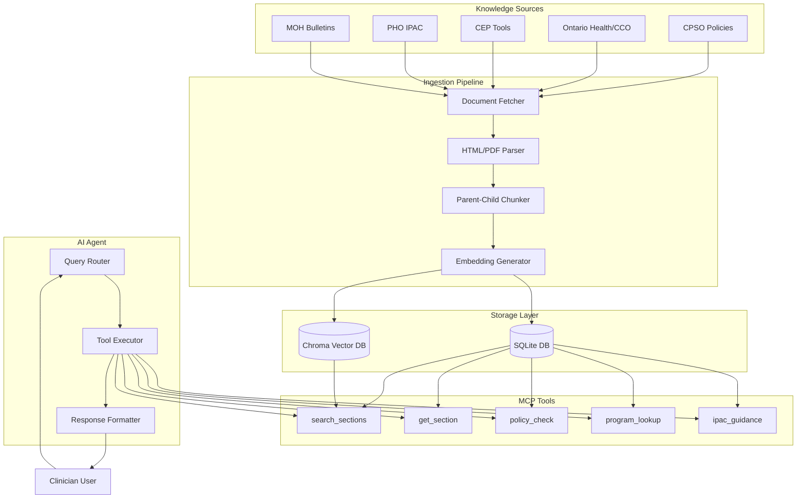

# Dr. OPA Technical Architecture

## System Overview

Dr. OPA is built as a modular AI agent system with three main components:

1. **Ingestion Pipeline**: Fetches, processes, and indexes authoritative documents
2. **MCP Tools**: Provides structured access to the knowledge base
3. **AI Agent**: Orchestrates tool usage and generates responses



## Component Architecture

### 1. Ingestion Pipeline

The ingestion pipeline follows a multi-stage processing approach:

#### Document Fetching
- HTTP client with retry logic and rate limiting
- User agent identification for compliance
- Support for HTML and PDF formats
- Cookie/session handling for authenticated sources

#### Document Parsing
- **HTML Processing**:
  - BeautifulSoup for DOM traversal
  - Content extraction using semantic selectors
  - Markdown-like formatting preservation
  - Table and list structure maintenance

- **PDF Processing**:
  - PyPDF2 for text extraction
  - Page-by-page processing
  - OCR fallback for scanned documents (planned)
  - Metadata extraction from PDF properties

#### Metadata Extraction
- **Temporal Metadata**:
  - Effective dates
  - Publication dates
  - Last updated dates
  - Review/revision dates

- **Categorical Metadata**:
  - Source organization
  - Document type (policy, guideline, tool, bulletin)
  - Topics (auto-extracted from content)
  - Policy level (CPSO: expectation vs advice)

- **Structural Metadata**:
  - Document ID (content hash)
  - Section headings
  - Page numbers (for PDFs)
  - URL anchors

#### Chunking Strategy

**Parent-Child Hierarchical Chunking**:

```
Document
├── Parent Chunk 1 (2500 tokens)
│   ├── Child 1.1 (500 tokens)
│   ├── Child 1.2 (500 tokens)
│   └── Child 1.3 (500 tokens)
├── Parent Chunk 2 (2500 tokens)
│   ├── Child 2.1 (500 tokens)
│   └── Child 2.2 (500 tokens)
```

- **Parent chunks**: Provide context, contain control tokens
- **Child chunks**: Enable precise retrieval, maintain overlap
- **Overlap**: 100 tokens between consecutive chunks

#### Embedding Generation
- OpenAI `text-embedding-3-small` model
- Batch processing (100 chunks per API call)
- Fallback to zero vectors on API failure
- Cost tracking and rate limiting

#### Control Tokens
Control tokens are prepended to parent chunks to enhance retrieval:

```
[ORG=cpso] [TOPIC=privacy,consent] [DATE=2024-05-15] [TYPE=policy]
```

Benefits:
- Improves semantic search accuracy
- Enables metadata-based filtering
- Provides context to embedding model

### 2. Storage Architecture

#### SQLite Database

**Schema Design**:

```sql
-- Document metadata and versioning
opa_documents
├── document_id (PK)
├── source_org
├── source_url
├── title
├── document_type
├── effective_date
├── updated_date
├── topics (JSON)
├── policy_level
├── is_superseded
└── superseded_by (FK)

-- Hierarchical chunk storage
opa_sections
├── section_id (PK)
├── document_id (FK)
├── chunk_type (parent/child)
├── parent_id (FK, nullable)
├── section_text
├── section_idx
├── chunk_idx
└── metadata_json

-- Ingestion tracking
ingestion_log
├── log_id (PK)
├── source_type
├── source_file
├── status
├── started_at
├── completed_at
└── error_message

-- Performance optimization
query_cache
├── cache_id (PK)
├── query_hash
├── result_json
├── created_at
└── access_count
```

**Indexes**:
- Document organization and type
- Section document relationships
- Cache query hashes
- Supersession status

#### Chroma Vector Database

**Collection Structure**:
- One collection per source organization
- Metadata filtering support
- Hierarchical relationship preservation

**Metadata Schema**:
```python
{
    "chunk_id": str,
    "document_id": str,
    "chunk_type": "parent|child",
    "parent_id": str | None,
    "source_org": str,
    "document_type": str,
    "effective_date": str,
    "topics": List[str],
    "policy_level": str | None
}
```

### 3. MCP Tools Architecture

The Model Context Protocol tools provide structured access to the knowledge base:

#### Tool Definitions

**opa.search_sections**:
- Hybrid search (vector + BM25)
- Metadata filtering
- Re-ranking based on dates
- Parent-child traversal

**opa.get_section**:
- Direct section retrieval by ID
- Full text with metadata
- Citation formatting
- Anchor URL construction

**opa.policy_check**:
- CPSO-specific retrieval
- Policy level filtering (expectation > advice)
- Regulatory focus

**opa.program_lookup**:
- Ontario Health program guidance
- Screening interval queries
- Pathway navigation

**opa.ipac_guidance**:
- PHO infection control
- Checklist retrieval
- Best practice sections

#### MCP Server Implementation

```python
# FastMCP server structure
app = FastMCP("Dr. OPA Agent")

@app.tool()
async def search_sections(
    query: str,
    source_org: Optional[str] = None,
    document_type: Optional[str] = None,
    n_results: int = 5,
    include_superseded: bool = False
) -> List[Section]:
    # Implementation
    pass

@app.tool()
async def get_section(
    section_id: str,
    include_parent: bool = False,
    include_children: bool = False
) -> SectionDetail:
    # Implementation
    pass
```

### 4. AI Agent Architecture

#### Query Router

The router analyzes incoming queries and selects appropriate tools:

```python
class QueryRouter:
    def route(self, query: str) -> List[ToolCall]:
        if self._is_policy_question(query):
            return [ToolCall("opa.policy_check", {...})]
        elif self._is_screening_question(query):
            return [ToolCall("opa.program_lookup", {...})]
        elif self._is_ipac_question(query):
            return [ToolCall("opa.ipac_guidance", {...})]
        else:
            return [ToolCall("opa.search_sections", {...})]
```

#### Tool Executor

Executes tools with retry logic and fallbacks:

```python
class ToolExecutor:
    async def execute(self, tool_calls: List[ToolCall]) -> List[ToolResult]:
        results = []
        for call in tool_calls:
            try:
                result = await self._execute_tool(call)
                results.append(result)
            except ToolError as e:
                # Fallback to broader search
                fallback_result = await self._fallback_search(call)
                results.append(fallback_result)
        return results
```

#### Response Formatter

Formats tool results with citations:

```python
class ResponseFormatter:
    def format(self, tool_results: List[ToolResult]) -> str:
        response = []
        
        # Synthesize main answer
        answer = self._synthesize_answer(tool_results)
        response.append(answer)
        
        # Add citations
        for result in tool_results:
            citation = self._format_citation(result)
            response.append(citation)
        
        # Add disclaimers if needed
        if self._needs_disclaimer(tool_results):
            response.append(PRACTICE_DISCLAIMER)
        
        return "\n\n".join(response)
```

## Performance Considerations

### Chunking Optimization
- Token counting using tiktoken for accuracy
- Sentence boundary preservation
- Paragraph-aware splitting
- Overlap tuning for context preservation

### Embedding Efficiency
- Batch processing to reduce API calls
- Caching of frequently accessed chunks
- Async processing for large documents
- Cost monitoring and budgeting

### Query Performance
- Query result caching with TTL
- Indexed metadata fields
- Pre-computed similarity scores for common queries
- Connection pooling for database access

### Scalability Design
- Horizontal scaling via multiple MCP server instances
- Read replicas for SQLite (using WAL mode)
- Chroma sharding by organization
- Queue-based ingestion for large batches

## Security Architecture

### Data Protection
- No PHI storage in knowledge base
- Public guidance documents only
- Encrypted storage at rest
- Secure API key management

### Access Control
- API key authentication for MCP tools
- Rate limiting per client
- Audit logging of all queries
- IP allowlisting (optional)

### Compliance
- PIPEDA compliance for data handling
- Transparent data sourcing
- Citation requirements enforced
- Version control for guidance updates

## Monitoring & Observability

### Metrics Collection
- Query latency (p50, p95, p99)
- Tool usage patterns
- Cache hit rates
- Embedding costs
- Error rates by component

### Logging Strategy
```
logs/
├── ingestion/
│   ├── 2024-01-15_cpso.log
│   └── 2024-01-15_ontario_health.log
├── queries/
│   ├── 2024-01-15_queries.jsonl
│   └── 2024-01-15_errors.log
├── mcp/
│   └── 2024-01-15_tool_calls.jsonl
└── agent/
    └── 2024-01-15_responses.jsonl
```

### Health Checks
- Database connectivity
- Chroma availability
- OpenAI API status
- Source website accessibility
- Corpus freshness validation

## Deployment Architecture

### Container Structure
```dockerfile
# Base image with Python 3.11
FROM python:3.11-slim

# Install dependencies
COPY requirements.txt .
RUN pip install -r requirements.txt

# Copy application
COPY src/agents/dr_opa_agent /app/dr_opa_agent

# Run MCP server
CMD ["python", "-m", "dr_opa_agent.mcp.server"]
```

### Service Dependencies
- OpenAI API (embeddings)
- SQLite (metadata storage)
- Chroma (vector storage)
- Source websites (document fetching)

### Environment Configuration
```yaml
# docker-compose.yml
services:
  dr-opa:
    image: dr-opa-agent:latest
    environment:
      - OPENAI_API_KEY=${OPENAI_API_KEY}
      - DATABASE_PATH=/data/opa.db
      - CHROMA_PATH=/data/chroma
      - LOG_LEVEL=INFO
    volumes:
      - ./data:/data
      - ./logs:/logs
    ports:
      - "8001:8000"
```

## Future Enhancements

### Planned Features
1. **OCR Support**: For scanned PDF documents
2. **Incremental Updates**: Delta ingestion for changed documents
3. **Multi-language Support**: French language guidance
4. **Webhook Integration**: Real-time updates from source changes
5. **Advanced Caching**: Redis integration for distributed cache
6. **GraphQL API**: Alternative to MCP for web clients

### Optimization Opportunities
1. **Embedding Model**: Evaluate newer models for better accuracy
2. **Chunk Sizing**: ML-based dynamic chunk sizing
3. **Query Understanding**: Fine-tuned classification model
4. **Response Generation**: RAG with citation preservation
5. **Batch Processing**: Async job queue for large ingestions