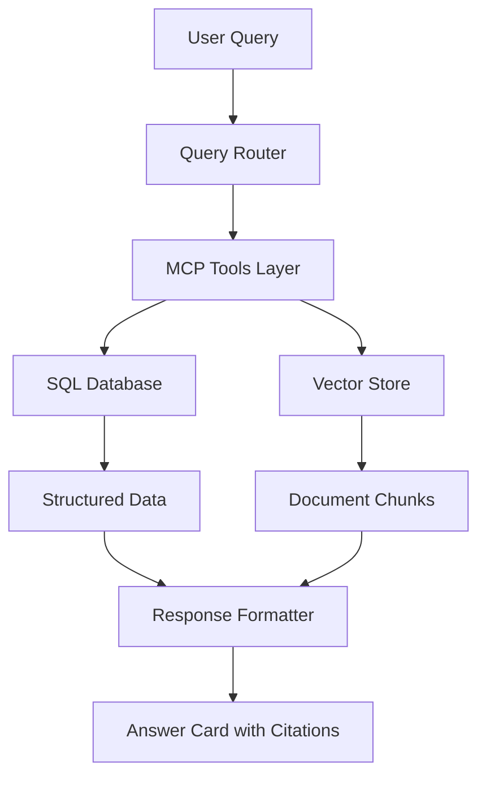

# Dr. OFF: Ontario Finance & Formulary AI Agent

## Mission

Dr. OFF is an AI agent designed to answer Ontario clinicians' questions about healthcare coverage and formulary information. It provides structured, evidence-based answers about drug coverage, billing codes, and assistive device funding from authoritative Ontario government sources.

**Key Value Proposition**: Dr. OFF bridges the gap between complex government documents and real-time clinical decision-making by providing instant, accurate, and cited answers to coverage questions.

## Questions Dr. OFF Can Answer

### ODB (Ontario Drug Benefit) Queries
- "Is [drug name] covered by ODB?"
- "What are the interchangeable options for [drug]?"
- "What's the lowest-cost product in this group?"
- "What's the patient co-pay for [drug]?"
- "Are there any special authorization requirements?"

### OHIP (Ontario Health Insurance Plan) Queries
- "Can I bill OHIP for [procedure/service]?"
- "What fee code applies for [procedure]?"
- "What's the billing amount for code [X]?"
- "What are the requirements for billing [service]?"

### ADP (Assistive Devices Program) Queries
- "Is [device] funded by ADP?"
- "What percentage does ADP cover for [mobility device]?"
- "What forms are required for [device category]?"
- "What are the eligibility criteria for [device]?"

## Use Cases

### For Clinicians (Direct Use)
- **Prescribing Decisions**: Check drug coverage before prescribing
- **Billing Support**: Verify OHIP codes and requirements
- **Patient Advocacy**: Understand ADP funding options for patients

### For Patients (Indirect Use)
- **Coverage Verification**: Clinicians can quickly verify coverage for patients
- **Cost Planning**: Understanding co-pays and funding percentages
- **Alternative Options**: Finding interchangeable, lower-cost medications

## Scope: Data Sources Coverage

### ODB (Ontario Drug Benefit)
- **Coverage**: 8,401+ drugs across therapeutic classes
- **Interchangeable Groups**: 2,369+ groups with lowest-cost identification
- **Data Source**: Official ODB Formulary Data Extract (XML)
- **PDF Manual**: ODB Formulary Edition 43 for policy context

### OHIP (Ontario Health Insurance Plan)
- **Fee Codes**: 2,000+ fee codes across medical specialties
- **Billing Requirements**: Detailed requirements and restrictions
- **Data Sources**: 
  - Schedule of Benefits PDF (fee codes and amounts)
  - Health Insurance Act Regulation 552 (policy and eligibility rules)

### ADP (Assistive Devices Program)
- **Device Categories**: Focus on Mobility Devices (wheelchairs, walkers, etc.)
- **Funding Rules**: 50+ funding scenarios with client share percentages
- **Exclusions**: 27+ documented exclusions and limitations
- **Data Sources**: ADP manuals for Communication Aids and Mobility Devices

## Architecture Overview

Dr. OFF follows a hybrid architecture combining structured data storage with semantic search:



### Key Components

1. **SQL Database**: Fast lookups for structured data (drug prices, fee codes)
2. **Vector Store**: Semantic search for policy context and citations
3. **MCP Tools**: Standardized functions for different query types
4. **Answer Cards**: Structured responses with decisions, data, and citations

## Implementation Status

### ✅ Completed (Task 1: Data Ingestion)
- **Database Schema**: 8 tables across ODB, OHIP, ADP data
- **ODB Ingestion**: 8,401 drugs, 2,369 interchangeable groups
- **OHIP Ingestion**: 2,123 fee codes (GP + Section A complete)
- **ADP Ingestion**: 199 document chunks, 50 funding rules, 27 exclusions
- **Health Insurance Act**: 86 SQL records, 36 vector embeddings

### 🔄 In Progress
- **OHIP Extraction**: Sections B-Z (in parallel batches)
- **Vector Embeddings**: Optimization for token limits

### ⏸️ Pending (Future Tasks)
- **MCP Tools**: Tool functions for data access
- **OpenAI Agent**: Agent implementation using OpenAI SDK
- **Web Integration**: UI components and API endpoints
- **Evaluation Framework**: Golden test sets and performance metrics

## Technical Implementation

See the following specialized documentation:

- **[Data Sources & Ingestion](./data_sources_ingestion.md)**: Detailed breakdown of data sources, parsing strategies, and ingestion pipelines
- **[Technical Architecture](./technical_architecture.md)**: Database schemas, vector embeddings, performance optimizations, and deployment considerations

## Getting Started

### Prerequisites
```bash
# Activate virtual environment
source ~/spacy_env/bin/activate

# Load environment variables
source .env  # Contains OPENAI_API_KEY, etc.
```

### Quick Test (Current Status)
```bash
# Test OHIP extraction
python test_assessment_enhanced.py

# Run quality evaluation
python evaluate_extraction_quality.py --input data/processed/subsections_enhanced.json

# View ingested data
sqlite3 data/processed/dr_off/dr_off.db
sqlite3 data/ohip.db
```

### Data Locations
- **Source Data**: `data/ontario/` (PDFs, XMLs, DOCs)
- **Processed Data**: `data/processed/` (JSON extractions)
- **Databases**: 
  - `data/processed/dr_off/dr_off.db` (Main SQLite database)
  - `data/ohip.db` (Enhanced with ADP and Act data)
- **Vector Store**: `.chroma/` (ChromaDB collections)

## Future Roadmap

### v1.1 Enhancements
- Additional ADP categories (Hearing, Respiratory devices)
- Monthly ODB update bulletins with change tracking
- Query rewriting for improved semantic recall

### v2.0 Advanced Features
- Multi-source cross-referencing (e.g., OHIP codes ↔ ODB coverage)
- Predictive coverage analysis
- Integration with clinical workflows

## Performance Targets

- **p50 latency**: < 0.8 seconds (warm cache)
- **p95 latency**: < 1.5 seconds (warm cache) 
- **Accuracy**: > 95% on golden test sets
- **Citation Coverage**: 100% of responses include page/section anchors

## Contributing

See the main repository's contribution guidelines. For Dr. OFF specific development:

1. Follow the existing clinical agent pattern under `src/agents/clinical/`
2. Use the established database schema in `src/agents/clinical/dr_off/ingestion/database.py`
3. All data ingestion must be idempotent and logged
4. Include comprehensive test coverage for new features

## Support

For technical questions about Dr. OFF implementation, refer to:
- **Issue #20**: Primary implementation tracking
- **Sync Document**: `scratch_pad/dr_off_sync.md`
- **Task Documentation**: `handover_task1_ingestion.md`