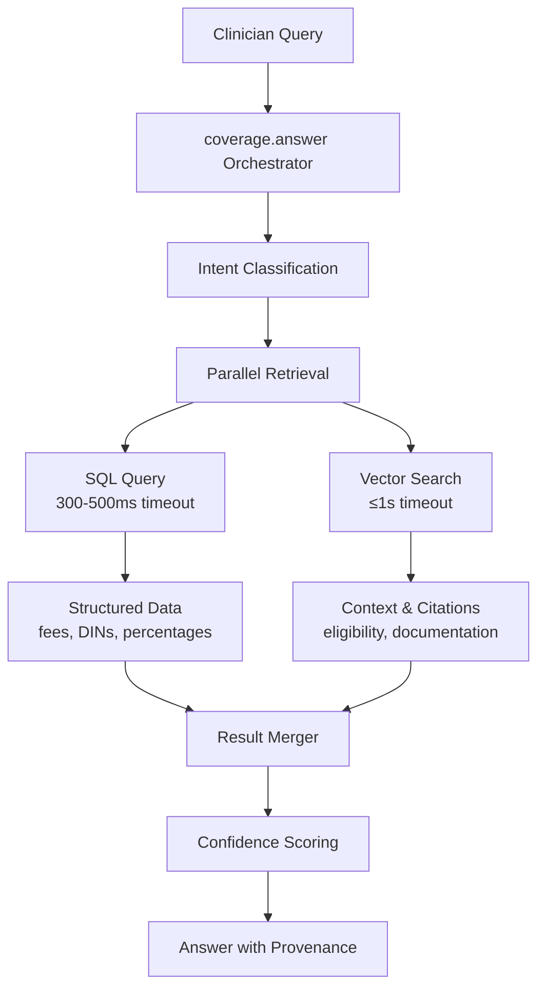

# Dr. OFF (Ontario Funding Finder) - Clinical Decision Support Agent

## 🎯 What is Dr. OFF?

Dr. OFF is an AI-powered clinical decision support agent designed to help Ontario physicians and healthcare administrators quickly navigate complex funding and billing rules. It provides instant, accurate answers with citations from official government sources.

**Key Value Proposition**: Transforms hours of manual document searching into seconds of AI-assisted precision, enabling clinicians to focus on patient care rather than administrative complexity.

## 👥 Target Users & Clinical Scenarios

### Primary Users
- **Physicians**: Quick billing guidance during/after patient encounters
- **Medical Administrators**: Coverage verification before prescribing/ordering
- **Hospital Discharge Planners**: Device funding for patient transitions
- **Clinic Staff**: Pre-authorization and eligibility checking

### Real-World Questions Dr. OFF Answers

#### Complex Discharge Scenarios
- "My 75yo patient is being discharged after 3 days. Can I bill C124 as MRP? Also needs a walker - what's covered?"
- "Patient admitted Monday 2pm, discharged Thursday 10am - which discharge codes apply?"

#### Drug Coverage & Alternatives
- "Is Januvia covered for my T2DM patient? Any cheaper alternatives?"
- "Ozempic for obesity vs diabetes - different coverage?"
- "What's the cheapest statin that's covered without LU?"

#### Device Funding & Eligibility
- "Patient with MS needs power wheelchair. Income $19,000 - CEP eligible?"
- "3-year-old scooter needs batteries and motor repair - what's covered?"
- "AAC device for ALS patient - funding percentage and forms?"

#### OHIP Billing Complexities
- "Can I bill consultation in ER as internist?"
- "House call for elderly patient - what premiums apply?"
- "Virtual care follow-up - which codes are valid?"

## 📚 Trusted Data Sources (Ground Truth Only)

### ODB (Ontario Drug Benefit)
- **Coverage**: 8,401+ drugs across therapeutic classes
- **Interchangeable Groups**: 2,369+ groups with lowest-cost identification
- **Data Source**: Official ODB Formulary Data Extract (XML)
- **PDF Manual**: ODB Formulary Edition 43 for policy context

### OHIP (Ontario Health Insurance Plan)
- **Fee Codes**: 2,000+ fee codes across medical specialties
- **Billing Requirements**: Detailed requirements and restrictions
- **Data Sources**: 
  - Schedule of Benefits PDF (fee codes and amounts)
  - Health Insurance Act Regulation 552 (policy and eligibility rules)

### ADP (Assistive Devices Program)
- **Device Categories**: Focus on Mobility Devices (wheelchairs, walkers, etc.)
- **Funding Rules**: 50+ funding scenarios with client share percentages
- **Exclusions**: 27+ documented exclusions and limitations
- **Data Sources**: ADP manuals for Communication Aids and Mobility Devices

## 🛡️ Key Principles & Guardrails

1. **Accuracy Over Speed**: Better to say "needs more info" than guess
2. **Always Cite Sources**: Every answer includes page/section references
3. **Dual Verification**: SQL for structured data + Vector for context (always both)
4. **Surface Conflicts**: If SQL and documents disagree, show both
5. **No Medical Advice**: Only billing/funding guidance, not clinical decisions

## ⚠️ What Dr. OFF Does NOT Do

- Provide clinical treatment recommendations
- Make diagnosis suggestions
- Recommend off-label drug use
- Access patient records or PHI
- Make coverage determinations (only provides information)

## Architecture Overview

Dr. OFF uses a **dual-path retrieval** architecture that always combines structured and semantic data:



### MCP Tool Architecture (5 Tools Only)

| Tool | Purpose | Always Returns |
|------|---------|----------------|
| `coverage.answer` | Main orchestrator - routes 80% of queries | decision, summary, citations, confidence |
| `schedule.get` | OHIP billing dual-path | provenance, items[], citations[] |
| `adp.get` | Device funding dual-path | eligibility, exclusions, funding, citations |
| `odb.get` | Drug formulary dual-path | coverage, interchangeable, lowest_cost |
| `source.passages` | Direct chunk retrieval | exact text for "show source" |

## Implementation Status

### ✅ Completed (Task 1: Data Ingestion)
- **Database Schema**: 8 tables across ODB, OHIP, ADP data
- **ODB Ingestion**: 8,401 drugs, 2,369 interchangeable groups
- **OHIP Ingestion**: 2,123 fee codes (GP + Section A complete)
- **ADP Ingestion**: 199 document chunks, 50 funding rules, 27 exclusions
- **Health Insurance Act**: 86 SQL records, 36 vector embeddings

### 🔄 In Progress
- **OHIP Extraction**: Sections B-Z (in parallel batches)
- **Vector Embeddings**: Optimization for token limits

### ⏸️ Pending (Future Tasks)
- **MCP Tools**: Tool functions for data access
- **OpenAI Agent**: Agent implementation using OpenAI SDK
- **Web Integration**: UI components and API endpoints
- **Evaluation Framework**: Golden test sets and performance metrics

## Technical Implementation

See the following specialized documentation:

- **[Data Sources & Ingestion](./data_sources_ingestion.md)**: Detailed breakdown of data sources, parsing strategies, and ingestion pipelines
- **[Technical Architecture](./technical_architecture.md)**: Database schemas, vector embeddings, performance optimizations, and deployment considerations

## Getting Started

### Prerequisites
```bash
# Activate virtual environment
source ~/spacy_env/bin/activate

# Load environment variables
source .env  # Contains OPENAI_API_KEY, etc.
```

### Quick Test (Current Status)
```bash
# Test OHIP extraction
python test_assessment_enhanced.py

# Run quality evaluation
python evaluate_extraction_quality.py --input data/processed/subsections_enhanced.json

# View ingested data
sqlite3 data/processed/dr_off/dr_off.db
sqlite3 data/ohip.db
```

### Data Locations
- **Source Data**: `data/ontario/` (PDFs, XMLs, DOCs)
- **Processed Data**: `data/processed/` (JSON extractions)
- **Databases**: 
  - `data/processed/dr_off/dr_off.db` (Main SQLite database)
  - `data/ohip.db` (Enhanced with ADP and Act data)
- **Vector Store**: `.chroma/` (ChromaDB collections)

## Future Roadmap

### v1.1 Enhancements
- Additional ADP categories (Hearing, Respiratory devices)
- Monthly ODB update bulletins with change tracking
- Query rewriting for improved semantic recall

### v2.0 Advanced Features
- Multi-source cross-referencing (e.g., OHIP codes ↔ ODB coverage)
- Predictive coverage analysis
- Integration with clinical workflows

## Performance Targets

- **p50 latency**: < 0.8 seconds (warm cache)
- **p95 latency**: < 1.5 seconds (warm cache) 
- **Accuracy**: > 95% on golden test sets
- **Citation Coverage**: 100% of responses include page/section anchors

## Contributing

See the main repository's contribution guidelines. For Dr. OFF specific development:

1. Follow the existing clinical agent pattern under `src/agents/clinical/`
2. Use the established database schema in `src/agents/clinical/dr_off/ingestion/database.py`
3. All data ingestion must be idempotent and logged
4. Include comprehensive test coverage for new features

## Support

For technical questions about Dr. OFF implementation, refer to:
- **Issue #20**: Primary implementation tracking
- **Sync Document**: `scratch_pad/dr_off_sync.md`
- **Task Documentation**: `handover_task1_ingestion.md`