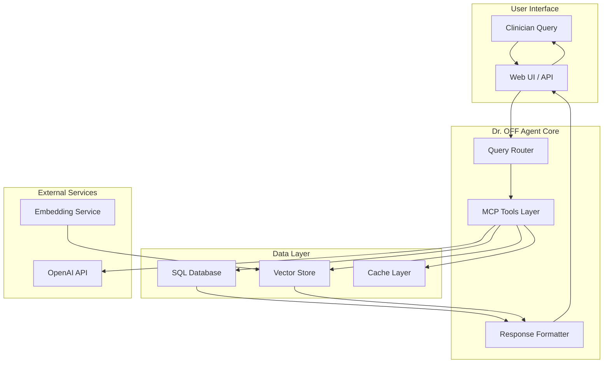
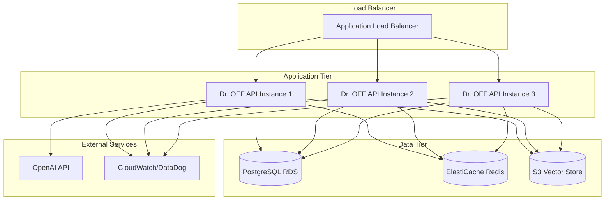

# Dr. OFF: Technical Architecture & Implementation

This document covers the technical implementation details, performance considerations, and deployment architecture for the Dr. OFF agent.

## System Architecture Overview

Dr. OFF follows a hybrid RAG (Retrieval-Augmented Generation) architecture that combines structured SQL queries with semantic vector search:



## Database Architecture

### SQL Database Schema

#### Core Design Principles
- **ACID Compliance**: Ensures data consistency for critical healthcare information
- **Cloud Portability**: SQLite for local development, PostgreSQL for production
- **Normalization**: Reduces redundancy while maintaining query performance
- **Indexing Strategy**: Optimized for common query patterns

#### Table Structure

```sql
-- ODB (Ontario Drug Benefit) Tables
odb_drugs (
    din TEXT PRIMARY KEY,              -- Drug Identification Number
    name TEXT NOT NULL,                -- Brand name
    generic_name TEXT,                 -- Generic ingredient name
    manufacturer_id TEXT,              -- Manufacturer reference
    strength TEXT,                     -- Dosage strength
    dosage_form TEXT,                  -- Tablet, capsule, etc.
    interchangeable_group_id TEXT,     -- Substitution group
    individual_price REAL,             -- Price per unit
    daily_cost REAL,                   -- Average daily cost
    is_lowest_cost BOOLEAN,            -- Cheapest in group flag
    -- Coverage flags
    is_benefit BOOLEAN,                -- Covered by ODB
    is_section_3 BOOLEAN,              -- Special authorization
    is_chronic_use BOOLEAN,            -- Chronic disease coverage
    -- Audit fields
    updated_date TIMESTAMP DEFAULT CURRENT_TIMESTAMP
)

odb_interchangeable_groups (
    group_id TEXT PRIMARY KEY,         -- Unique group identifier
    generic_name TEXT NOT NULL,        -- Common active ingredient
    therapeutic_class TEXT,            -- Therapeutic category
    member_count INTEGER,              -- Number of products in group
    lowest_cost_din TEXT,              -- DIN of cheapest option
    lowest_cost_price REAL,            -- Price of cheapest option
    updated_date TIMESTAMP DEFAULT CURRENT_TIMESTAMP
)

-- OHIP (Ontario Health Insurance Plan) Tables
ohip_fee_schedule (
    fee_code TEXT PRIMARY KEY,         -- Billing code (e.g., A001, K083)
    description TEXT NOT NULL,         -- Service description
    amount REAL,                       -- Billable amount
    specialty TEXT,                    -- Medical specialty
    category TEXT,                     -- Service category
    requirements TEXT,                 -- Billing requirements
    page_number INTEGER,               -- PDF page reference
    section TEXT,                      -- Schedule section
    updated_date TIMESTAMP DEFAULT CURRENT_TIMESTAMP
)

-- Health Insurance Act Rules
act_eligibility_rule (
    rule_id INTEGER PRIMARY KEY,
    rule_type TEXT,                    -- eligibility, coverage, etc.
    rule_text TEXT,
    section_reference TEXT,
    applies_to TEXT,
    updated_date TIMESTAMP DEFAULT CURRENT_TIMESTAMP
)

-- ADP (Assistive Devices Program) Tables
adp_funding_rule (
    rule_id INTEGER PRIMARY KEY,
    adp_doc TEXT,                      -- Source document
    section_ref TEXT,                  -- Section reference
    scenario TEXT,                     -- Funding scenario
    client_share_percent INTEGER,     -- Patient cost share %
    details TEXT,                      -- Additional details
    updated_date TIMESTAMP DEFAULT CURRENT_TIMESTAMP
)

adp_exclusion (
    exclusion_id INTEGER PRIMARY KEY,
    adp_doc TEXT,                      -- Source document
    section_ref TEXT,                  -- Section reference
    phrase TEXT,                       -- Exclusion text
    applies_to TEXT,                   -- Device category
    updated_date TIMESTAMP DEFAULT CURRENT_TIMESTAMP
)

-- Document Management
document_chunks (
    chunk_id TEXT PRIMARY KEY,         -- Unique chunk identifier
    source_type TEXT NOT NULL,         -- odb, ohip, adp
    source_document TEXT NOT NULL,     -- Original filename
    chunk_text TEXT NOT NULL,          -- Extracted text
    chunk_index INTEGER,               -- Position in document
    page_number INTEGER,               -- PDF page reference
    section TEXT,                      -- Document section
    fee_codes_list TEXT,               -- Associated fee codes (JSON)
    embedding_id TEXT,                 -- Vector store reference
    metadata_json TEXT,                -- Additional metadata
    created_date TIMESTAMP DEFAULT CURRENT_TIMESTAMP
)

-- System Management
ingestion_log (
    log_id INTEGER PRIMARY KEY AUTOINCREMENT,
    source_type TEXT NOT NULL,
    source_file TEXT NOT NULL,
    status TEXT NOT NULL,              -- started, completed, failed
    records_processed INTEGER DEFAULT 0,
    records_failed INTEGER DEFAULT 0,
    error_message TEXT,
    started_at TIMESTAMP DEFAULT CURRENT_TIMESTAMP,
    completed_at TIMESTAMP
)
```

#### Indexing Strategy

```sql
-- Primary lookup indexes
CREATE INDEX idx_odb_generic ON odb_drugs(generic_name);
CREATE INDEX idx_odb_group ON odb_drugs(interchangeable_group_id);
CREATE INDEX idx_odb_lowest ON odb_drugs(is_lowest_cost) WHERE is_lowest_cost = TRUE;

CREATE INDEX idx_ohip_specialty ON ohip_fee_schedule(specialty);
CREATE INDEX idx_ohip_category ON ohip_fee_schedule(category);

CREATE INDEX idx_adp_category ON adp_funding_rule(adp_doc);
CREATE INDEX idx_chunk_source ON document_chunks(source_type, source_document);

-- Composite indexes for common queries
CREATE INDEX idx_drug_lookup ON odb_drugs(generic_name, strength, dosage_form);
CREATE INDEX idx_fee_search ON ohip_fee_schedule(specialty, category);
```

### Vector Database Architecture

#### ChromaDB Implementation

**Collection Structure**:
```python
collections = {
    'odb_documents': {
        'purpose': 'ODB policy and formulary context',
        'chunk_size': '900-1200 tokens',
        'embedding_model': 'text-embedding-3-small',
        'metadata': ['source_file', 'page_number', 'section']
    },
    'ohip_chunks': {
        'purpose': 'OHIP Schedule and Act regulatory text',
        'chunk_size': '900-1200 tokens', 
        'metadata': ['section', 'subsection', 'fee_codes', 'page_number']
    },
    'adp_v1': {
        'purpose': 'ADP manual subsections',
        'chunk_size': '200-600 tokens',
        'metadata': ['document', 'section_ref', 'topic_tags']
    }
}
```

#### Embedding Strategy

**Model**: OpenAI `text-embedding-3-small`
- **Dimensions**: 1536
- **Cost**: $0.00002 per 1K tokens
- **Performance**: Optimized for semantic similarity

**Chunking Parameters**:
```python
CHUNK_CONFIG = {
    'target_size': 1000,           # Target tokens per chunk
    'max_size': 1200,              # Maximum before forced split
    'overlap': 200,                # Token overlap between chunks
    'split_on': ['\\n\\n', '\\n', '. '],  # Preferred split points
    'preserve_structure': True      # Maintain section boundaries
}
```

#### Metadata Schema

```json
{
  "chunk_id": "odb_formulary_p123_c1",
  "source_type": "odb",
  "source_document": "odb-formulary-edition-43.pdf",
  "page_number": 123,
  "section": "Section 3 - Special Authorization",
  "subsection": "3.1 Cardiovascular Drugs",
  "content_type": "policy_text",
  "fee_codes_mentioned": ["A001", "A002"],
  "drug_categories": ["cardiovascular"],
  "embedding_model": "text-embedding-3-small",
  "created_date": "2025-09-23T10:00:00Z",
  "quality_score": 0.95
}
```

## Parsing Approaches

### Regex vs. LLM Strategy

Dr. OFF employs a hybrid parsing approach optimized for different data types:

| Data Type | Primary Method | Secondary Method | Rationale |
|-----------|----------------|------------------|-----------|
| **Drug Prices** | XML Parser | - | Structured data, 100% accuracy needed |
| **Fee Codes** | LLM Extraction | Regex Validation | Complex tables, context required |
| **Policy Text** | LLM Chunking | Regex Cleanup | Semantic understanding needed |
| **Forms/URLs** | Regex Pattern | LLM Verification | Consistent patterns |

### LLM-Based Extraction

#### OHIP Fee Code Extraction
```python
EXTRACTION_PROMPT = """
Extract all fee codes and their details from this OHIP Schedule subsection.

IMPORTANT FORMATTING RULES:
1. Fee codes follow pattern: [Letter][3-4 digits][optional letter] (e.g., K001, GP21, A1234a)
2. Look for multi-column layouts with H/P, Asst, Surg, Anae columns
3. Extract time-based fees (per 30min, per hour, etc.)
4. Include all requirements and restrictions mentioned

Return as JSON array with format:
[{
  "fee_code": "K001",
  "description": "Detention (per 30 minutes)",
  "amount": 21.10,
  "specialty": "General Practice",
  "requirements": "Maximum 6 units per day",
  "notes": "Billing restrictions apply"
}]
"""
```

#### Quality Control Mechanisms
```python
def validate_extraction(extracted_data):
    """Validate LLM extraction results."""
    checks = {
        'fee_code_format': validate_fee_code_regex,
        'amount_range': validate_reasonable_amounts,
        'completeness': check_expected_codes,
        'duplicates': identify_duplicate_codes
    }
    
    quality_score = sum(check(extracted_data) for check in checks.values()) / len(checks)
    return quality_score >= QUALITY_THRESHOLD
```

### Regex Patterns

#### Fee Code Validation
```python
FEE_CODE_PATTERNS = {
    'standard': r'^[A-Z]{1,2}\d{3,4}[a-z]?$',     # A001, GP21, K083a
    'general_practice': r'^GP\d{2}[a-z]?$',        # GP21, GP01a
    'anesthesia': r'^[A-Z]\d{4}[a-z]?$',          # A1234a
    'diagnostic': r'^[X-Z]\d{3}$'                  # X123, Y456
}
```

#### Data Cleaning Patterns
```python
CLEANUP_PATTERNS = {
    'currency': r'\$?(\d+\.?\d*)',                 # Extract dollar amounts
    'percentage': r'(\d+)%',                       # Extract percentages
    'din_format': r'(\d{8})',                      # 8-digit DIN codes
    'section_refs': r'Section (\d+\.?\d*\.?\d*)'   # Section references
}
```

## Async Tasks & Batch Processing

### Ingestion Pipeline Performance

#### Current Performance Metrics
```python
PERFORMANCE_BENCHMARKS = {
    'odb_ingestion': {
        'total_records': 8401,
        'processing_time': '45 seconds',
        'throughput': '187 records/second',
        'memory_usage': '~50MB peak'
    },
    'ohip_extraction': {
        'sections_completed': ['GP', 'A'],
        'total_codes_extracted': 2123,
        'avg_processing_time': '3-5 seconds/subsection',
        'parallel_workers': 8,
        'memory_per_worker': '~100MB'
    },
    'adp_ingestion': {
        'total_chunks': 199,
        'processing_time': '90 seconds',
        'embedding_generation': '45 seconds',
        'sql_insertion': '15 seconds'
    }
}
```

#### Async Processing Implementation

```python
import asyncio
import aiofiles
from concurrent.futures import ThreadPoolExecutor

class AsyncIngestionManager:
    def __init__(self, max_workers=8):
        self.max_workers = max_workers
        self.executor = ThreadPoolExecutor(max_workers=max_workers)
    
    async def process_sections_parallel(self, sections):
        """Process multiple OHIP sections in parallel."""
        tasks = []
        semaphore = asyncio.Semaphore(self.max_workers)
        
        async def process_with_semaphore(section):
            async with semaphore:
                return await self.process_section(section)
        
        for section in sections:
            task = asyncio.create_task(process_with_semaphore(section))
            tasks.append(task)
        
        results = await asyncio.gather(*tasks, return_exceptions=True)
        return results
    
    async def batch_embed_chunks(self, chunks, batch_size=100):
        """Generate embeddings in batches to respect API limits."""
        batches = [chunks[i:i+batch_size] for i in range(0, len(chunks), batch_size)]
        
        for batch in batches:
            embeddings = await self.generate_embeddings_batch(batch)
            await self.store_embeddings(batch, embeddings)
            await asyncio.sleep(1)  # Rate limiting
```

#### Memory Management

```python
class MemoryEfficientProcessor:
    def __init__(self, max_memory_mb=500):
        self.max_memory_mb = max_memory_mb
        self.chunk_size = self.calculate_optimal_chunk_size()
    
    def process_large_document(self, document_path):
        """Process large documents in memory-efficient chunks."""
        with open(document_path, 'r') as f:
            while True:
                chunk = f.read(self.chunk_size)
                if not chunk:
                    break
                    
                processed = self.process_chunk(chunk)
                self.store_chunk(processed)
                
                # Memory cleanup
                del chunk, processed
                gc.collect()
```

### Batch Processing Strategies

#### OHIP Section Grouping
```python
SECTION_GROUPS = {
    'small_sections': ['GP', 'B'],           # < 50 pages each
    'medium_sections': ['A', 'C'],           # 50-150 pages each  
    'large_sections': ['D_E_F_G_H'],        # 150+ pages combined
    'special_handling': ['C'],               # Complex layouts
}

def group_sections_by_size(sections):
    """Group sections by estimated processing time."""
    grouped = defaultdict(list)
    
    for section in sections:
        size_category = estimate_section_size(section)
        grouped[size_category].append(section)
    
    return grouped
```

#### Error Recovery & Retry Logic
```python
@retry(max_attempts=3, backoff_factor=2)
async def resilient_extraction(section):
    """Extract with automatic retry on failures."""
    try:
        return await extract_section(section)
    except MemoryError:
        # Reduce chunk size and retry
        return await extract_section_reduced_chunks(section)
    except APIRateLimitError:
        # Exponential backoff
        await asyncio.sleep(random.uniform(30, 60))
        raise  # Will trigger retry
    except Exception as e:
        logger.error(f"Section {section} failed: {e}")
        raise
```

## Data Quality Evaluation System

### Quality Metrics Framework

```python
class QualityEvaluator:
    def __init__(self):
        self.metrics = {
            'format_accuracy': FormatAccuracyMetric(),
            'completeness': CompletenessMetric(),
            'consistency': ConsistencyMetric(),
            'citation_accuracy': CitationMetric()
        }
    
    def evaluate_extraction(self, extracted_data, source_file):
        """Comprehensive quality evaluation."""
        scores = {}
        
        for metric_name, metric in self.metrics.items():
            score = metric.calculate(extracted_data, source_file)
            scores[metric_name] = score
        
        overall_score = self.calculate_weighted_score(scores)
        return {
            'overall_score': overall_score,
            'individual_scores': scores,
            'recommendation': self.get_recommendation(overall_score),
            'issues': self.identify_issues(extracted_data)
        }
```

#### Specific Quality Checks

**Format Accuracy (30% weight)**:
```python
def validate_fee_code_format(fee_codes):
    """Validate fee code formats against known patterns."""
    valid_count = 0
    
    for code in fee_codes:
        if re.match(r'^[A-Z]{1,2}\d{3,4}[a-z]?$', code['fee_code']):
            valid_count += 1
    
    return valid_count / len(fee_codes)
```

**Completeness (40% weight)**:
```python
def check_extraction_completeness(section, extracted_codes):
    """Compare extracted codes against expected counts."""
    expected_counts = SECTION_EXPECTED_COUNTS.get(section, None)
    
    if expected_counts:
        actual_count = len(extracted_codes)
        return min(actual_count / expected_counts, 1.0)
    
    return 1.0  # No baseline available
```

**Citation Accuracy (10% weight)**:
```python
def validate_page_references(chunks):
    """Ensure page references are accurate."""
    valid_references = 0
    
    for chunk in chunks:
        if verify_page_content_match(chunk['page_number'], chunk['text']):
            valid_references += 1
    
    return valid_references / len(chunks)
```

### Automated Quality Assurance

```python
class AutoQA:
    def __init__(self, quality_threshold=0.85):
        self.quality_threshold = quality_threshold
        self.evaluator = QualityEvaluator()
    
    def run_quality_pipeline(self, extraction_results):
        """Run automated quality checks."""
        results = self.evaluator.evaluate_extraction(extraction_results)
        
        if results['overall_score'] >= self.quality_threshold:
            self.approve_extraction(extraction_results)
        else:
            self.flag_for_review(extraction_results, results['issues'])
            if results['overall_score'] < 0.60:
                self.trigger_re_extraction(extraction_results)
        
        return results
```

## Performance Optimization

### Query Optimization

#### SQL Query Performance
```sql
-- Optimized drug lookup with multiple filters
SELECT 
    d.din, d.name, d.individual_price, d.is_lowest_cost,
    g.generic_name, g.lowest_cost_price
FROM odb_drugs d
JOIN odb_interchangeable_groups g ON d.interchangeable_group_id = g.group_id
WHERE 
    d.generic_name ILIKE ? 
    AND d.is_benefit = TRUE
    AND d.status = 'active'
ORDER BY d.individual_price ASC
LIMIT 20;

-- Index usage for this query:
-- idx_odb_generic (generic_name filter)
-- idx_odb_lowest (is_benefit filter)
-- Primary key join on group_id
```

#### Vector Search Optimization
```python
def optimized_vector_search(query, collection, limit=20):
    """Optimized vector search with pre-filtering."""
    
    # Pre-filter by metadata to reduce search space
    metadata_filter = {
        "source_type": {"$eq": determine_source_type(query)},
        "content_type": {"$eq": determine_content_type(query)}
    }
    
    # Use query expansion for better recall
    expanded_query = expand_query_terms(query)
    
    # Perform search with hybrid scoring
    results = collection.query(
        query_texts=[expanded_query],
        n_results=limit * 2,  # Over-retrieve for re-ranking
        where=metadata_filter,
        include=['metadatas', 'documents', 'distances']
    )
    
    # Re-rank with cross-encoder for precision
    reranked = rerank_results(query, results, limit)
    
    return reranked
```

### Caching Strategy

#### Multi-Level Caching
```python
class CacheManager:
    def __init__(self):
        self.memory_cache = TTLCache(maxsize=1000, ttl=3600)  # 1 hour
        self.disk_cache = DiskCache('cache/dr_off', size_limit=1e9)  # 1GB
        self.db_cache = DatabaseCache('cache_table')  # Persistent
    
    def get(self, key):
        """Check caches in order: memory -> disk -> database."""
        # L1: Memory cache (fastest)
        if key in self.memory_cache:
            return self.memory_cache[key]
        
        # L2: Disk cache (fast)
        if key in self.disk_cache:
            value = self.disk_cache[key]
            self.memory_cache[key] = value
            return value
        
        # L3: Database cache (persistent)
        value = self.db_cache.get(key)
        if value:
            self.memory_cache[key] = value
            self.disk_cache[key] = value
        
        return value
```

#### Cache Key Strategy
```python
def generate_cache_key(query_type, parameters):
    """Generate consistent cache keys."""
    key_parts = [
        query_type,
        hashlib.md5(json.dumps(parameters, sort_keys=True).encode()).hexdigest(),
        get_data_version_hash()  # Invalidate on data changes
    ]
    return ":".join(key_parts)
```

### Performance Monitoring

```python
class PerformanceMonitor:
    def __init__(self):
        self.metrics = defaultdict(list)
    
    @contextmanager
    def measure(self, operation_name):
        """Context manager for measuring operation time."""
        start_time = time.time()
        start_memory = psutil.Process().memory_info().rss
        
        try:
            yield
        finally:
            end_time = time.time()
            end_memory = psutil.Process().memory_info().rss
            
            self.metrics[operation_name].append({
                'duration': end_time - start_time,
                'memory_delta': end_memory - start_memory,
                'timestamp': datetime.now()
            })
    
    def get_performance_report(self):
        """Generate performance summary."""
        report = {}
        
        for operation, measurements in self.metrics.items():
            durations = [m['duration'] for m in measurements]
            report[operation] = {
                'count': len(measurements),
                'avg_duration': statistics.mean(durations),
                'p50_duration': statistics.median(durations),
                'p95_duration': np.percentile(durations, 95),
                'max_duration': max(durations)
            }
        
        return report
```

## Deployment Considerations

### Local Development Setup

```yaml
# docker-compose.yml for local development
version: '3.8'
services:
  dr-off-db:
    image: postgres:15
    environment:
      POSTGRES_DB: dr_off_dev
      POSTGRES_USER: dr_off
      POSTGRES_PASSWORD: dev_password
    volumes:
      - ./data/postgres:/var/lib/postgresql/data
    ports:
      - "5432:5432"
  
  chroma-db:
    image: chromadb/chroma:latest
    ports:
      - "8000:8000"
    volumes:
      - ./data/chroma:/chroma/chroma
    environment:
      - CHROMA_SERVER_HOST=0.0.0.0
  
  redis-cache:
    image: redis:alpine
    ports:
      - "6379:6379"
    volumes:
      - ./data/redis:/data
```

### Cloud Deployment Architecture



### Production Configuration

```python
# config/production.py
class ProductionConfig:
    # Database
    DATABASE_URL = os.getenv('DATABASE_URL')  # PostgreSQL connection
    DATABASE_POOL_SIZE = 20
    DATABASE_MAX_OVERFLOW = 30
    
    # Vector Store
    CHROMA_HOST = os.getenv('CHROMA_HOST', 'chroma.internal')
    CHROMA_PORT = int(os.getenv('CHROMA_PORT', 8000))
    
    # Cache
    REDIS_URL = os.getenv('REDIS_URL')
    CACHE_TTL_SECONDS = 3600
    
    # API Limits
    RATE_LIMIT_PER_MINUTE = 60
    MAX_CONCURRENT_REQUESTS = 100
    
    # Performance
    ASYNC_WORKER_COUNT = 10
    EMBEDDING_BATCH_SIZE = 50
    
    # Monitoring
    ENABLE_METRICS = True
    LOG_LEVEL = 'INFO'
    HEALTH_CHECK_INTERVAL = 30
```

### Scaling Considerations

#### Horizontal Scaling
- **Stateless Design**: All state in external stores (DB, Redis, S3)
- **Load Balancing**: Round-robin with health checks
- **Auto Scaling**: Based on CPU, memory, and request queue depth

#### Database Scaling
- **Read Replicas**: For query-heavy workloads
- **Connection Pooling**: pgBouncer for PostgreSQL
- **Query Optimization**: Regular EXPLAIN analysis

#### Vector Store Scaling
- **Sharding**: Distribute collections across multiple Chroma instances
- **Caching**: Aggressive caching of embedding results
- **Batch Processing**: Optimize embedding generation

### Monitoring & Alerting

```python
# monitoring/metrics.py
class MetricsCollector:
    def __init__(self):
        self.counter = prometheus_client.Counter
        self.histogram = prometheus_client.Histogram
        self.gauge = prometheus_client.Gauge
        
        # Define metrics
        self.query_duration = self.histogram(
            'dr_off_query_duration_seconds',
            'Time spent processing queries',
            buckets=[0.1, 0.5, 1.0, 2.0, 5.0]
        )
        
        self.query_count = self.counter(
            'dr_off_queries_total',
            'Total queries processed',
            ['query_type', 'status']
        )
        
        self.database_connections = self.gauge(
            'dr_off_db_connections_active',
            'Active database connections'
        )
```

## Security Considerations

### Data Protection
- **Encryption at Rest**: All databases encrypted with AES-256
- **Encryption in Transit**: TLS 1.3 for all API communications
- **Access Control**: Role-based access to different data sources
- **Audit Logging**: Complete audit trail of all data access

### API Security
```python
# security/middleware.py
class SecurityMiddleware:
    def __init__(self):
        self.rate_limiter = RateLimiter()
        self.auth_validator = AuthValidator()
    
    async def process_request(self, request):
        # Rate limiting
        if not self.rate_limiter.allow(request.client.host):
            raise HTTPException(429, "Rate limit exceeded")
        
        # Authentication
        if not self.auth_validator.validate(request.headers.get('Authorization')):
            raise HTTPException(401, "Invalid authentication")
        
        # Input validation
        validated_input = self.validate_input(request.body)
        request.validated_input = validated_input
```

### PHI Compliance
- **Data Anonymization**: Remove patient identifiers from logs
- **Access Logging**: Log all access to sensitive healthcare data
- **Retention Policies**: Automatic deletion of old logs and cache entries

This technical architecture ensures Dr. OFF can scale efficiently while maintaining the performance and reliability requirements for clinical use in Ontario healthcare settings.