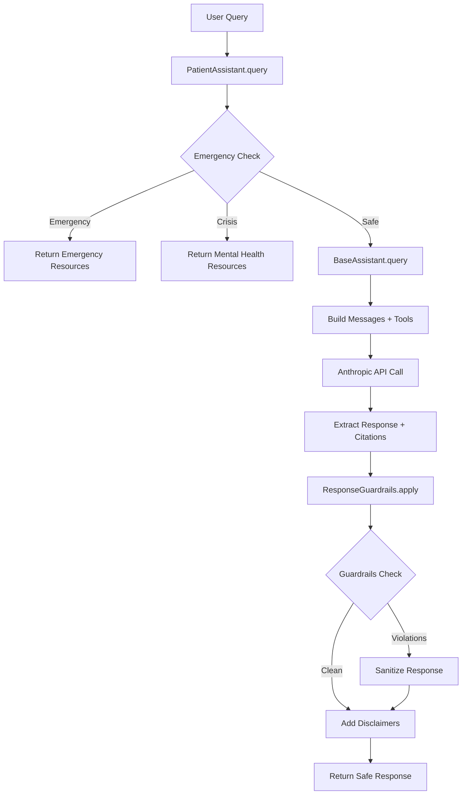

# Health Assistant API Specification

## Overview
The Health Assistant system provides AI-powered medical education and information through a modular architecture with strict safety guardrails. The system uses Anthropic's Claude API with web_fetch capabilities to provide evidence-based medical information from trusted sources.

## Architecture

```
PatientAssistant
      ↓
BaseAssistant (handles Anthropic API calls)
      ↓
ResponseGuardrails (applies safety filters)
      ↓
Settings (configuration management)
```

## BaseAssistant

### Class: `BaseAssistant`
**Location:** `src/assistants/base.py`

Base class for all assistant implementations, handling core Anthropic API interactions.

#### Constructor
```python
BaseAssistant(config: Optional[AssistantConfig] = None)
```

**Parameters:**
- `config`: Optional configuration object. If not provided, uses default settings.

**Configuration (AssistantConfig):**
- `model`: Claude model to use (default: "claude-3-opus-20240229")
- `max_tokens`: Maximum response tokens (default: 1500)
- `temperature`: Model temperature 0.0-1.0 (default: 0.7)
- `system_prompt`: System instruction for the model
- `trusted_domains`: List of allowed domains for web_fetch
- `enable_web_fetch`: Enable/disable web fetching (default: True)
- `citations_enabled`: Include citations in responses (default: True)
- `max_web_fetch_uses`: Max web fetches per query (default: 5)

#### Methods

##### `query(query: str, session_id: Optional[str] = None) -> Dict[str, Any]`
Send a query to the Anthropic API.

**Parameters:**
- `query`: User's question or query text
- `session_id`: Optional session identifier for logging

**Returns:**
```python
{
    "content": str,           # Response text with citations if enabled
    "model": str,             # Model used for generation
    "usage": {
        "input_tokens": int,  # Input token count
        "output_tokens": int  # Output token count
    },
    "citations": List[Dict],  # List of citations from web_fetch
    "session_id": str         # Session identifier
}
```

**Raises:**
- `ValueError`: If ANTHROPIC_API_KEY is not set
- `Exception`: If API call fails

#### Internal Methods

##### `_build_messages(query: str) -> List[Dict[str, str]]`
Constructs the message list for the API request.

##### `_build_tools() -> Optional[List[Dict[str, Any]]]`
Configures the web_fetch tool with allowed domains.

##### `_extract_citations(response: Message) -> List[Dict[str, str]]`
Extracts citations from the API response.

##### `_format_response_with_citations(content: str, citations: List[Dict]) -> str`
Formats the response with citation links.

## PatientAssistant

### Class: `PatientAssistant`
**Location:** `src/assistants/patient.py`

Specialized assistant for patient education with enhanced safety features.

#### Constructor
```python
PatientAssistant()
```

Automatically configures itself using patient-specific settings from configuration files.

#### Methods

##### `query(query: str, session_id: Optional[str] = None) -> Dict[str, Any]`
Process a patient query with safety checks and guardrails.

**Parameters:**
- `query`: Patient's medical question or concern
- `session_id`: Optional session identifier for logging

**Returns:**
```python
{
    "content": str,                    # Safe, educational response
    "model": str,                      # Model used
    "usage": Dict,                     # Token usage
    "citations": List[Dict],           # Source citations
    "mode": "patient",                 # Assistant mode
    "guardrails_applied": bool,        # Whether guardrails modified response
    "violations": List[str],           # Detected policy violations
    "emergency_detected": bool,        # Emergency content detected
    "mental_health_crisis": bool,      # Mental health crisis detected
    "session_id": str                  # Session identifier
}
```

**Safety Features:**
1. **Pre-query checks:**
   - Emergency detection (chest pain, breathing issues, etc.)
   - Mental health crisis detection (suicide, self-harm)
   - Returns appropriate resources without querying API

2. **Post-response guardrails:**
   - Removes diagnostic language
   - Removes treatment recommendations
   - Adds medical disclaimers
   - Sanitizes forbidden phrases

3. **Error handling:**
   - Returns safe error messages
   - Includes emergency contact information

## ResponseGuardrails

### Class: `ResponseGuardrails`
**Location:** `src/utils/guardrails.py`

Applies safety filters and modifications to AI responses.

#### Methods

##### `apply(response: str, session_id: Optional[str] = None) -> Dict[str, Any]`
Apply all guardrails to a response.

**Parameters:**
- `response`: Original AI response text
- `session_id`: Optional session identifier

**Returns:**
```python
{
    "original_response": str,       # Original unmodified response
    "content": str,                 # Modified safe response
    "guardrails_triggered": bool,   # Whether any guardrails activated
    "violations": List[str],        # List of policy violations detected
    "emergency_detected": bool,     # Emergency content detected
    "mental_health_crisis": bool,   # Mental health crisis detected
    "session_id": str               # Session identifier
}
```

### Utility Functions

##### `check_forbidden_phrases(response: str) -> List[str]`
Checks for diagnostic or treatment language.

##### `detect_emergency_content(text: str) -> bool`
Detects medical emergency keywords.

##### `detect_mental_health_crisis(text: str) -> bool`
Detects mental health crisis indicators.

##### `sanitize_response(response: str) -> str`
Removes or replaces forbidden phrases.

##### `apply_disclaimers(response: str) -> str`
Adds appropriate medical disclaimers.

## Configuration

### Settings Management
**Location:** `src/config/settings.py`

The system uses Pydantic settings with YAML configuration files:

- **prompts.yaml**: System prompts for different modes
- **disclaimers.yaml**: Medical disclaimers and emergency resources
- **domains.yaml**: Trusted medical domains for web_fetch

### Environment Variables
```bash
ANTHROPIC_API_KEY=sk-ant-...        # Required: Anthropic API key
PRIMARY_MODEL=claude-3-opus-20240229 # Primary Claude model
ASSISTANT_MODE=patient               # Mode: patient or physician
ENABLE_GUARDRAILS=true              # Enable safety guardrails
ENABLE_WEB_FETCH=true               # Enable web search
```

## API Flow Diagram



## Usage Examples

### Basic Patient Query
```python
from src.assistants.patient import PatientAssistant

assistant = PatientAssistant()
response = assistant.query(
    "What are the common symptoms of diabetes?",
    session_id="user-123"
)

print(response["content"])
# Output includes educational information with disclaimers
```

### Emergency Detection
```python
response = assistant.query(
    "I'm having severe chest pain and can't breathe",
    session_id="user-123"
)

print(response["emergency_detected"])  # True
print(response["content"])  # Emergency redirect message
```

### With Citations
```python
response = assistant.query(
    "What are the latest CDC guidelines for flu prevention?",
    session_id="user-123"
)

print(response["citations"])
# [{"url": "https://cdc.gov/flu/prevent/...", "title": "Flu Prevention"}]
```

## Error Handling

All methods include comprehensive error handling:

1. **API Errors**: Caught and logged, safe error message returned
2. **Configuration Errors**: Validated at startup with clear messages
3. **Emergency Situations**: Immediately redirected without API call
4. **Network Issues**: Graceful degradation with user-friendly messages

## Logging

All operations are logged with structured JSON format:

```json
{
    "timestamp": "2024-01-01T12:00:00",
    "level": "INFO",
    "name": "src.assistants.patient",
    "message": "Patient query received",
    "session_id": "user-123",
    "query_length": 45,
    "mode": "patient"
}
```

Log files are stored in `logs/health_assistant.log` with automatic rotation.

## Testing

Comprehensive test coverage includes:

- **Unit Tests**: All classes and methods
- **Integration Tests**: API interactions
- **Safety Tests**: Guardrail effectiveness
- **Emergency Tests**: Crisis detection accuracy

Run tests with:
```bash
pytest tests/unit/
pytest tests/integration/
pytest tests/e2e/
```

## Security Considerations

1. **API Key Protection**: Never log or expose API keys
2. **Input Validation**: All user input sanitized
3. **Output Filtering**: Multiple layers of safety checks
4. **Domain Restriction**: Only trusted medical sources
5. **No Diagnosis**: Strictly educational content only
6. **Session Isolation**: No cross-session data leakage

## Performance

- **Response Time**: Typically 2-5 seconds
- **Token Limits**: 1500 tokens per response (configurable)
- **Web Fetch**: Max 5 fetches per query (configurable)
- **Caching**: Not implemented (stateless design)

## Future Enhancements

1. **Physician Mode**: Technical language and extended sources
2. **Multi-Agent Orchestration**: MAI-DxO pattern for complex queries
3. **Batch Processing**: Handle multiple queries efficiently
4. **Analytics**: Track usage patterns and safety metrics
5. **Internationalization**: Multi-language support