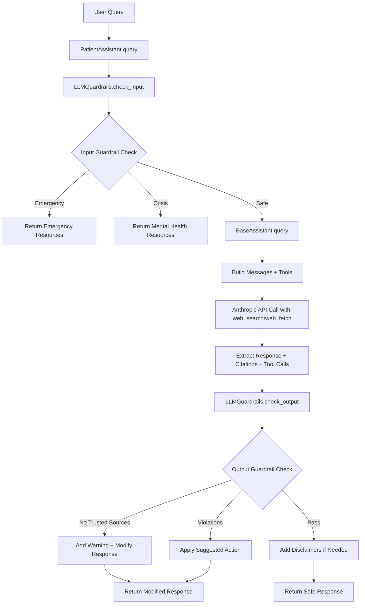

# Health Assistant API Specification

## Overview
The Health Assistant system provides AI-powered medical education and information through a modular architecture with strict safety guardrails. The system uses Anthropic's Claude API with web_search and web_fetch capabilities to provide evidence-based medical information from trusted sources.

## Architecture

```
PatientAssistant
      ↓
BaseAssistant (handles Anthropic API calls)
      ↓
LLMGuardrails (intelligent safety checks)
      ↓
ResponseGuardrails (regex fallback)
      ↓
Settings (configuration management)
```

## BaseAssistant

### Class: `BaseAssistant`
**Location:** `src/assistants/base.py`

Base class for all assistant implementations, handling core Anthropic API interactions.

#### Constructor
```python
BaseAssistant(config: Optional[AssistantConfig] = None)
```

**Parameters:**
- `config`: Optional configuration object. If not provided, uses default settings.

**Configuration (AssistantConfig):**
- `model`: Claude model to use (default: "claude-3-5-sonnet-latest")
- `max_tokens`: Maximum response tokens (default: 1500)
- `temperature`: Model temperature 0.0-1.0 (default: 0.7)
- `system_prompt`: System instruction for the model
- `trusted_domains`: List of allowed domains for web_fetch (97 medical domains)
- `enable_web_fetch`: Enable/disable web fetching (default: True)
- `citations_enabled`: Include citations in responses (default: True)
- `max_web_fetch_uses`: Max web fetches per query (default: 5)

#### Methods

##### `query(query: str, session_id: Optional[str] = None) -> Dict[str, Any]`
Send a query to the Anthropic API.

**Parameters:**
- `query`: User's question or query text
- `session_id`: Optional session identifier for logging

**Returns:**
```python
{
    "content": str,           # Response text with citations if enabled
    "model": str,             # Model used for generation
    "usage": {
        "input_tokens": int,  # Input token count
        "output_tokens": int  # Output token count
    },
    "citations": List[Dict],  # List of citations from web_fetch
    "tool_calls": List[Dict], # Tool calls made (web_search, web_fetch)
    "session_id": str         # Session identifier
}
```

**Raises:**
- `ValueError`: If ANTHROPIC_API_KEY is not set
- `Exception`: If API call fails

#### Internal Methods

##### `_build_messages(query: str) -> List[Dict[str, str]]`
Constructs the message list for the API request.

##### `_build_tools() -> Optional[List[Dict[str, Any]]]`
Configures the web_search and web_fetch tools with allowed domains.

##### `_extract_citations(response: Message) -> List[Dict[str, str]]`
Extracts citations from the API response.

##### `_format_response_with_citations(content: str, citations: List[Dict]) -> str`
Formats the response with citation links.

## PatientAssistant

### Class: `PatientAssistant`
**Location:** `src/assistants/patient.py`

Specialized assistant for patient education with enhanced safety features.

#### Constructor
```python
PatientAssistant(guardrail_mode: str = "hybrid")
```

**Parameters:**
- `guardrail_mode`: Guardrail checking mode - "llm", "regex", or "hybrid" (default: "hybrid")

Automatically configures itself using patient-specific settings from configuration files.

#### Methods

##### `query(query: str, session_id: Optional[str] = None) -> Dict[str, Any]`
Process a patient query with safety checks and guardrails.

**Parameters:**
- `query`: Patient's medical question or concern
- `session_id`: Optional session identifier for logging

**Returns:**
```python
{
    "content": str,                    # Safe, educational response
    "model": str,                      # Model used
    "usage": Dict,                     # Token usage
    "citations": List[Dict],           # Source citations
    "mode": "patient",                 # Assistant mode
    "guardrails_applied": bool,        # Whether guardrails modified response
    "violations": List[str],           # Detected policy violations
    "emergency_detected": bool,        # Emergency content detected
    "mental_health_crisis": bool,      # Mental health crisis detected
    "session_id": str                  # Session identifier
}
```

**Safety Features:**
1. **Pre-query checks:**
   - Emergency detection (chest pain, breathing issues, etc.)
   - Mental health crisis detection (suicide, self-harm)
   - Returns appropriate resources without querying API

2. **Post-response guardrails:**
   - Removes diagnostic language
   - Removes treatment recommendations
   - Adds medical disclaimers
   - Sanitizes forbidden phrases

3. **Error handling:**
   - Returns safe error messages
   - Includes emergency contact information

## LLMGuardrails

### Class: `LLMGuardrails`
**Location:** `src/utils/llm_guardrails.py`

Intelligent LLM-based guardrails that act as tripwires before and after the main LLM call.

#### Constructor
```python
LLMGuardrails(mode: str = "llm", model: str = "claude-3-5-haiku-latest")
```

**Parameters:**
- `mode`: Checking mode - "llm", "regex", or "hybrid"
- `model`: Model to use for guardrail checks (faster/cheaper model recommended)

#### Methods

##### `check_input(query: str, session_id: Optional[str] = None) -> Dict[str, Any]`
Check user input for emergencies or crises before main LLM call.

**Returns:**
```python
{
    "requires_intervention": bool,       # True if emergency/crisis detected
    "intervention_type": str,           # "emergency", "mental_health_crisis", or "none"
    "explanation": str,                  # LLM's reasoning for decision
    "should_block": bool                # Whether to block the query
}
```

##### `check_output(response: str, citations: List[Dict], session_id: Optional[str], tool_calls: List[Dict]) -> Dict[str, Any]`
Check assistant output for quality and safety after main LLM call.

**Returns:**
```python
{
    "passes_guardrails": bool,          # True if response is safe
    "violations": List[str],            # List of violations found
    "explanation": str,                  # Explanation of issues
    "suggested_action": str,             # Action to take
    "modified_response": str,            # Modified safe response
    "web_search_performed": bool,       # Whether web search was used
    "has_trusted_citations": bool       # Whether citations are from trusted domains
}
```

**Key Features:**
1. **Code-based verification**: Checks that web_search/web_fetch tools were called
2. **Trusted domain validation**: Ensures citations come from 97 whitelisted medical domains
3. **Medical content detection**: Identifies responses requiring sources
4. **LLM review**: Intelligent analysis for diagnosis, treatment advice, disclaimers
5. **Hybrid mode**: Falls back to regex patterns if LLM fails

**Violation Types:**
- `DIAGNOSIS`: Response suggests specific diagnosis
- `TREATMENT`: Recommends specific treatments or medications
- `MEDICAL_ADVICE`: Provides personalized medical advice
- `MISSING_DISCLAIMER`: Lacks appropriate medical disclaimers
- `UNTRUSTED_SOURCES`: Cites non-trusted domains
- `NO_CITATIONS`: Makes medical claims without citations
- `NO_TRUSTED_SOURCES`: Medical info without trusted citations

## ResponseGuardrails

### Class: `ResponseGuardrails`
**Location:** `src/utils/guardrails.py`

Regex-based safety filters and modifications to AI responses (fallback system).

#### Methods

##### `apply(response: str, session_id: Optional[str] = None) -> Dict[str, Any]`
Apply all guardrails to a response.

**Parameters:**
- `response`: Original AI response text
- `session_id`: Optional session identifier

**Returns:**
```python
{
    "original_response": str,       # Original unmodified response
    "content": str,                 # Modified safe response
    "guardrails_triggered": bool,   # Whether any guardrails activated
    "violations": List[str],        # List of policy violations detected
    "emergency_detected": bool,     # Emergency content detected
    "mental_health_crisis": bool,   # Mental health crisis detected
    "session_id": str               # Session identifier
}
```

### Utility Functions

##### `check_forbidden_phrases(response: str) -> List[str]`
Checks for diagnostic or treatment language.

##### `detect_emergency_content(text: str) -> bool`
Detects medical emergency keywords.

##### `detect_mental_health_crisis(text: str) -> bool`
Detects mental health crisis indicators.

##### `sanitize_response(response: str) -> str`
Removes or replaces forbidden phrases.

##### `apply_disclaimers(response: str) -> str`
Adds appropriate medical disclaimers.

## Configuration

### Settings Management
**Location:** `src/config/settings.py`

The system uses Pydantic settings with YAML configuration files:

- **prompts.yaml**: System prompts for different modes (patient/physician)
- **disclaimers.yaml**: Medical disclaimers and emergency resources
- **domains.yaml**: 97 trusted medical domains for web_fetch
- **guardrail_prompts.yaml**: LLM prompts for input/output guardrails

### Environment Variables
```bash
ANTHROPIC_API_KEY=sk-ant-...        # Required: Anthropic API key
PRIMARY_MODEL=claude-3-opus-20240229 # Primary Claude model
ASSISTANT_MODE=patient               # Mode: patient or physician
ENABLE_GUARDRAILS=true              # Enable safety guardrails
ENABLE_WEB_FETCH=true               # Enable web search
```

## API Flow Diagram



## Guardrail Behavior

### Input Guardrail Triggers

When the input guardrail detects an emergency or crisis:

1. **Emergency Detection** (e.g., "I'm having chest pain right now"):
   - The LLM guardrail immediately blocks the query
   - No API call is made to the main assistant
   - **User receives this message:**
     ```
     🚨 **MEDICAL EMERGENCY DETECTED**
     
     Your symptoms may require immediate medical attention.
     
     **CALL 911 IMMEDIATELY** or go to your nearest emergency room if you are experiencing:
     - Chest pain or pressure
     - Difficulty breathing
     - Severe bleeding
     - Loss of consciousness
     - Stroke symptoms
     - Severe allergic reaction
     
     **Emergency Resources:**
     - 📞 Emergency Services: 911
     - 📞 Poison Control: 1-800-222-1222
     - 📍 Find nearest ER: https://www.medicare.gov/hospitalcompare/search.html
     
     This AI assistant cannot provide emergency medical assistance. Please seek immediate professional help.
     ```

2. **Mental Health Crisis** (e.g., "I want to end my life"):
   - Query is blocked before processing
   - **User receives this message:**
     ```
     💚 **We're Here to Help**
     
     If you're experiencing thoughts of suicide or self-harm, please know that you're not alone 
     and help is available right now.
     
     **Immediate Support:**
     - 📞 **988 Suicide & Crisis Lifeline**: Call or text 988 (Available 24/7)
     - 📞 **Crisis Text Line**: Text HOME to 741741
     - 📞 **International Crisis Lines**: https://findahelpline.com
     
     **Additional Resources:**
     - 🌐 Online Chat: https://988lifeline.org/chat
     - 🌐 Veterans Crisis Line: 1-800-273-8255, Press 1
     - 🌐 LGBTQ+ Support: 1-866-488-7386
     - 🌐 SAMHSA National Helpline: 1-800-662-4357
     
     **For immediate danger, call 911**
     
     This AI assistant cannot provide crisis counseling. Please reach out to these professional 
     resources who have trained counselors ready to help you.
     ```

### Output Guardrail Triggers

When the output guardrail detects violations:

1. **No Trusted Sources** (medical info without citations):
   - Adds warning wrapper to response
   - **User receives modified message:**
     ```
     ⚠️ **Note**: The following information needs to be verified with trusted medical sources.
     
     [Original response content about medical topic]
     
     ⚠️ **Important**: Please consult verified medical sources or healthcare providers for accurate information.
     ```

2. **Diagnosis Detected** (e.g., response contains "You have diabetes"):
   - If severe violation, **user receives:**
     ```
     I apologize, but I cannot provide that information as it may contain medical advice 
     that should only come from a healthcare provider. Please consult with a medical 
     professional for personalized guidance.
     ```
   - If mild violation, diagnostic language is replaced:
     - "you have" → "this may indicate"
     - "your symptoms" → "these symptoms"
     - User sees the modified educational content

3. **Missing Disclaimer**:
   - **User receives response with added disclaimers:**
     ```
     ⚠️ **Medical Disclaimer**: This information is for educational purposes only 
     and is not a substitute for professional medical advice.
     
     [Original response content]
     
     💡 **Remember**: Please consult with a healthcare provider for personalized medical advice.
     ```

4. **Treatment Recommendations** (e.g., "Take 2 aspirin daily"):
   - Specific advice is removed
   - **User receives generalized message:**
     ```
     ⚠️ **Medical Disclaimer**: This information is for educational purposes only 
     and is not a substitute for professional medical advice.
     
     Common treatments for this condition are typically prescribed by healthcare providers 
     based on individual patient needs. These may include various medications and therapies 
     that should be discussed with your doctor.
     
     💡 **Remember**: Please consult with a healthcare provider for personalized medical advice.
     ```

## Usage Examples

### Basic Patient Query
```python
from src.assistants.patient import PatientAssistant

assistant = PatientAssistant()
response = assistant.query(
    "What are the common symptoms of diabetes?",
    session_id="user-123"
)

print(response["content"])
# Output includes educational information with disclaimers
```

### Emergency Detection (Input Guardrail Triggered)
```python
response = assistant.query(
    "I'm having severe chest pain and can't breathe",
    session_id="user-123"
)

print(response["emergency_detected"])  # True
print(response["content"])  # Emergency redirect message - no API call made
```

### Different Guardrail Modes
```python
# LLM-only mode (most intelligent)
assistant = PatientAssistant(guardrail_mode="llm")

# Regex-only mode (fastest, pattern-based)
assistant = PatientAssistant(guardrail_mode="regex")

# Hybrid mode (default - LLM with regex fallback)
assistant = PatientAssistant(guardrail_mode="hybrid")
```

### Response with Violations (Output Guardrail Triggered)
```python
# If the API returns diagnostic content
response = assistant.query(
    "Based on my symptoms, what condition do I have?",
    session_id="user-123"
)

# Output guardrail will modify the response
print(response["guardrails_applied"])  # True
print(response["violations"])  # ["DIAGNOSIS", "MISSING_DISCLAIMER"]
print(response["content"])  # Modified safe response with disclaimers
```

### With Citations
```python
response = assistant.query(
    "What are the latest CDC guidelines for flu prevention?",
    session_id="user-123"
)

print(response["citations"])
# [{"url": "https://cdc.gov/flu/prevent/...", "title": "Flu Prevention"}]
```

## Error Handling

All methods include comprehensive error handling:

1. **API Errors**: Caught and logged, safe error message returned
2. **Configuration Errors**: Validated at startup with clear messages
3. **Emergency Situations**: Immediately redirected without API call
4. **Network Issues**: Graceful degradation with user-friendly messages

## Logging

All operations are logged with structured JSON format:

```json
{
    "timestamp": "2024-01-01T12:00:00",
    "level": "INFO",
    "name": "src.assistants.patient",
    "message": "Patient query received",
    "session_id": "user-123",
    "query_length": 45,
    "mode": "patient"
}
```

Log files are stored in `logs/health_assistant.log` with automatic rotation.

## Testing

Comprehensive test coverage includes:

- **Unit Tests**: All classes and methods
- **Integration Tests**: API interactions
- **Safety Tests**: Guardrail effectiveness
- **Emergency Tests**: Crisis detection accuracy

Run tests with:
```bash
pytest tests/unit/
pytest tests/integration/
pytest tests/e2e/
```

## Security Considerations

1. **API Key Protection**: Never log or expose API keys
2. **Input Validation**: All user input sanitized
3. **Output Filtering**: Multiple layers of safety checks
4. **Domain Restriction**: Only trusted medical sources
5. **No Diagnosis**: Strictly educational content only
6. **Session Isolation**: No cross-session data leakage

## Performance

- **Response Time**: Typically 2-5 seconds
- **Token Limits**: 1500 tokens per response (configurable)
- **Web Fetch**: Max 5 fetches per query (configurable)
- **Caching**: Not implemented (stateless design)

## Future Enhancements

1. **Physician Mode**: Technical language and extended sources
2. **Multi-Agent Orchestration**: MAI-DxO pattern for complex queries
3. **Batch Processing**: Handle multiple queries efficiently
4. **Analytics**: Track usage patterns and safety metrics
5. **Internationalization**: Multi-language support