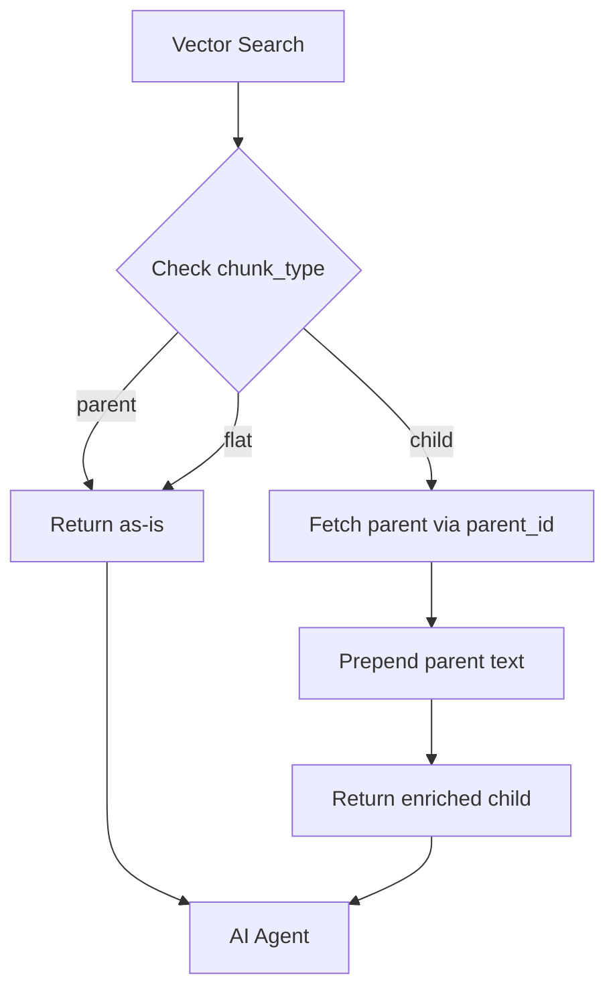

# Parent/Child Chunk Handling Guide for AI Agents

**Date:** October 6, 2025
**Scope:** Dr. OPA and Dr. OFF retrieval systems
**Purpose:** Guide AI agents to understand and effectively use parent/child chunked documents

---

## Executive Summary

All collections in Dr. OPA and Dr. OFF now use **parent/child chunking** to provide optimal context while preventing information loss. This document explains what parent/child chunks are, how they work, and how AI agents should interpret them.

---

## What Are Parent/Child Chunks?

### Parent Chunks
- **Size:** 200-800 words (optimal for semantic search)
- **Content:** Complete sections or groups of related information
- **Purpose:** Provide full context for semantic understanding
- **Metadata:** `chunk_type: "parent"`

**Examples:**
- All fee codes in an OHIP subsection (e.g., "Neurosurgery (04)")
- All formulations of a drug (e.g., all Bilastine brands)
- Complete ADP policy section (e.g., "Part 2 - Section 200")

### Child Chunks
- **Size:** 150-600 words
- **Content:** Subset of parent chunk when parent would exceed 800 words
- **Purpose:** Prevent information loss for large sections
- **Metadata:** `chunk_type: "child"`, `parent_id: "{parent_chunk_id}"`

**Examples:**
- Second half of a large OHIP subsection
- Additional formulations when drug has 15+ variants
- Continuation of a lengthy ADP policy section

### Flat Chunks
- **No parent/child relationship**
- **Used for:** Single documents, standalone policies
- **Metadata:** `chunk_type: "flat"` (or omitted)

---

## How Parent Context Enrichment Works

### Automatic Enrichment

When a **child chunk** is retrieved from the vector database, the system **automatically enriches it** by:

1. **Detecting** the child chunk via `chunk_type: "child"` metadata
2. **Fetching** the parent chunk using `parent_id` metadata
3. **Prepending** the parent content to the child text

**Enriched Format:**
```
[PARENT CONTEXT - {section_title}]
{full parent text}

[DETAILED CONTENT]
{child chunk text}
```

### AI Agent Perspective

From the AI agent's perspective:
- **Transparent:** Enrichment happens automatically in the retrieval layer
- **No special handling needed:** Child chunks arrive with full context already included
- **Metadata flag:** `has_parent_context: true` indicates enrichment occurred

---

## How AI Agents Should Interpret Chunks

### 1. **Understanding Chunk Types**

#### Parent Chunks
- **Contain:** Complete, self-contained information
- **Use:** Directly as authoritative source
- **Citation:** Use `section_path` for hierarchical reference

**Example:**
```json
{
  "text": "OHIP Fee Code A001 - Neurosurgical consultation...",
  "metadata": {
    "chunk_type": "parent",
    "section_path": "OHIP Schedule of Benefits > Surgery > Neurosurgery (04)",
    "section_title": "Neurosurgery (04)",
    "fee_code_count": 23
  }
}
```

**AI Interpretation:**
- This is a **complete subsection** of OHIP fee codes
- Contains all 23 fee codes for Neurosurgery (04)
- No additional context needed

#### Child Chunks (Enriched)
- **Contain:** Parent context + detailed continuation
- **Use:** Full context available via prepended parent text
- **Citation:** Use `section_path` (same as parent)

**Example:**
```json
{
  "text": "[PARENT CONTEXT - Neurosurgery (04)]\n{first 23 fee codes}\n\n[DETAILED CONTENT]\n{remaining 25 fee codes}",
  "metadata": {
    "chunk_type": "child",
    "parent_id": "ohip_abc123_parent",
    "section_path": "OHIP Schedule of Benefits > Surgery > Neurosurgery (04)",
    "has_parent_context": true
  }
}
```

**AI Interpretation:**
- This is a **continuation** of the parent chunk
- Parent context provides **full understanding** of the section
- Detailed content contains **additional fee codes** not in parent
- Combined text gives **complete picture** of all Neurosurgery (04) codes

#### Flat Chunks
- **Contain:** Standalone information (no parent/child relationship)
- **Use:** Directly as-is
- **Citation:** Use `section_path` if available

**Example:**
```json
{
  "text": "The Choosing Wisely recommendation states...",
  "metadata": {
    "chunk_type": "flat",
    "section_path": "Choosing Wisely Canada > Cardiology > Recommendation #3"
  }
}
```

**AI Interpretation:**
- This is a **complete, self-contained** recommendation
- No parent/child relationship
- Use directly without needing additional context

---

### 2. **Reading Enriched Child Chunks**

When you encounter a child chunk with `has_parent_context: true`:

#### Step 1: Identify the Parent Context
Look for the `[PARENT CONTEXT - {title}]` marker at the beginning of the text.

**What it contains:**
- Full text of the parent chunk
- Provides complete section context
- May include related information (e.g., other fee codes, policy sections)

#### Step 2: Identify the Detailed Content
Look for the `[DETAILED CONTENT]` marker after the parent context.

**What it contains:**
- Additional information that didn't fit in the parent chunk
- Continuation of the section
- More examples, codes, or policy details

#### Step 3: Synthesize Both Parts
- **Parent context:** Gives you the "big picture" of the section
- **Detailed content:** Gives you additional specific information
- **Combined:** Provides complete understanding of the topic

**Example Interpretation:**

```
User Query: "What OHIP codes are available for neurosurgical procedures?"

Retrieved Child Chunk:
[PARENT CONTEXT - Neurosurgery (04)]
Codes A001-A023 include consultations, craniotomies, and brain surgeries...

[DETAILED CONTENT]
Codes A024-A048 include spinal surgeries, nerve repairs, and complex procedures...

AI Response:
"OHIP provides 48 codes for neurosurgical procedures under section Neurosurgery (04):
- **Consultations & Brain Surgeries (A001-A023):** Includes consultations, craniotomies...
- **Spinal & Nerve Procedures (A024-A048):** Includes spinal surgeries, nerve repairs...

Source: OHIP Schedule of Benefits > Surgery > Neurosurgery (04)"
```

---

### 3. **Using section_path for Citations**

All chunks now include `section_path` metadata for hierarchical citations.

#### Format
```
{source} > {level_1} > {level_2} > {level_3}
```

#### Examples

**Dr. OPA:**
```
"OPA Practice Guide > CPSO > Prescribing Drugs > Opioid Prescribing"
"Choosing Wisely Canada > Cardiology > Diagnostic Testing"
"Public Health Ontario > Infection Prevention > Hand Hygiene"
```

**Dr. OFF:**
```
"OHIP Schedule of Benefits > Surgery > Neurosurgery (04)"
"Assistive Devices Program > Core Manual > Part 2 > Section 200"
"Ontario Drug Benefit Formulary > Antihistamines > Bilastine"
```

#### How to Cite

**Always prefer section_path over generic source names:**

❌ **Bad:**
```
"According to the ADP manual..."
```

✅ **Good:**
```
"According to ADP Core Manual > Part 2 > Section 200..."
```

✅ **Better:**
```
"Source: Assistive Devices Program > Core Manual > Part 2 > Section 200"
```

**For child chunks, cite the section_path (not the parent_id):**
- section_path is the **user-facing hierarchical reference**
- parent_id is an **internal technical identifier**

---

## Common Scenarios & How to Handle

### Scenario 1: Retrieving Multiple Parent Chunks
**What you get:**
- Multiple complete sections
- No overlap (each parent is independent)

**How to use:**
- Synthesize information across all parents
- Cite each parent separately with section_path

**Example:**
```
Query: "What are the OHIP codes for eye surgeries?"

Retrieved:
1. Parent: "OHIP > Ophthalmology > General Eye Procedures (E)"
2. Parent: "OHIP > Ophthalmology > Retinal Surgery (E)"

Response:
"OHIP provides eye surgery codes under two categories:
1. General Eye Procedures (E): Codes E001-E025...
2. Retinal Surgery (E): Codes E050-E075...

Sources:
- OHIP Schedule of Benefits > Ophthalmology > General Eye Procedures (E)
- OHIP Schedule of Benefits > Ophthalmology > Retinal Surgery (E)"
```

### Scenario 2: Retrieving Parent + Child from Same Section
**What you get:**
- Parent chunk with partial information
- Child chunk with parent context + additional details

**How to use:**
- **Combine both chunks** to get complete section
- **De-duplicate information** from parent context
- Cite the section_path once (they're the same section)

**Example:**
```
Query: "All ADP eligibility requirements for wheelchairs"

Retrieved:
1. Parent: "ADP > Mobility > Part 3 > Section 300" (587 words)
2. Child: "[PARENT CONTEXT]...same 587 words...[DETAILED CONTENT]...additional 345 words..."

Response:
"ADP wheelchair eligibility requirements include:
- Basic mobility needs (from parent)
- Ontario residency (from parent)
- Valid prescription (from parent)
- Income thresholds (from child's detailed content)
- Equipment-specific criteria (from child's detailed content)

Source: Assistive Devices Program > Mobility > Part 3 > Section 300"
```

### Scenario 3: Child Chunk Without Parent in Results
**What you get:**
- Enriched child chunk with `has_parent_context: true`
- Parent context automatically prepended

**How to use:**
- Use the enriched text directly
- No need to search for the parent separately
- Cite using section_path

**Example:**
```
Query: "ODB coverage for Cetirizine HCl formulations 10-18"

Retrieved:
1. Child only: "[PARENT CONTEXT - CETIRIZINE HYDROCHLORIDE]\nFormulations 1-9...\n\n[DETAILED CONTENT]\nFormulations 10-18..."

Response:
"ODB covers 18 formulations of Cetirizine HCl. Formulations 10-18 include:
- Teva Cetirizine 10mg (DIN 02...)
- Sandoz Cetirizine 10mg (DIN 02...)
...

Source: Ontario Drug Benefit Formulary > Antihistamines > Cetirizine Hydrochloride"
```

---

## Best Practices for AI Agents

### 1. ✅ **Trust Automatic Enrichment**
- If `has_parent_context: true`, the text already includes full context
- No need to manually fetch parent chunks
- System guarantees complete information

### 2. ✅ **Use section_path for All Citations**
- More informative than generic source names
- Shows user exactly where information came from
- Enables hierarchical navigation

### 3. ✅ **De-duplicate When Seeing Parent + Child**
- Parent text appears in both parent chunk AND child's `[PARENT CONTEXT]`
- Don't repeat the same information twice
- Synthesize unique content from both

### 4. ✅ **Read Enriched Chunks Carefully**
- Parent context gives you the "big picture"
- Detailed content gives you specifics
- Both are needed for complete understanding

### 5. ✅ **Understand Chunk Boundaries**
- Parent chunks are complete sections (200-800 words)
- Child chunks indicate content exceeded 800 words
- Flat chunks are standalone (no parent/child relationship)

### 6. ❌ **Don't Ignore Parent Context**
- Child chunks **depend on parent context** for understanding
- Skipping parent context leads to incomplete answers
- Always read the full enriched text

### 7. ❌ **Don't Cite parent_id**
- parent_id is a technical identifier
- Use section_path for user-facing citations

---

## Technical Implementation Details

### Metadata Schema

**Universal Fields (All Collections):**
```python
{
    'section_path': str,        # "Source > Section > Subsection"
    'section_title': str,       # Current section/subsection title
    'chunk_type': str,          # 'parent' | 'child' | 'flat'
    'parent_id': Optional[str], # Link to parent chunk (for children)
    'word_count': int,          # Chunk word count
    'has_parent_context': bool  # True if child was enriched (added by retrieval)
}
```

### Parent Context Enrichment Flow



### Collection Coverage

**All Dr. OPA Collections:**
- ✅ CEP Tools (1,054 chunks with parents/children)
- ✅ CPSO Policies (325 chunks)
- ✅ PHO IPAC (132 chunks)
- ✅ Choosing Wisely (295 chunks: 212 parents, 83 children)
- ✅ Quality Standards (340 chunks)

**All Dr. OFF Collections:**
- ✅ OHIP Schedule (379 chunks: 172 parents, 207 children)
- ✅ ADP (214 chunks: 203 parents, 11 children)
- ✅ ODB Formulary (3,885 chunks: 3,316 parents, 569 children)

---

## Troubleshooting

### "I got a child chunk without parent context"
- **Check:** `has_parent_context` metadata field
- **Expected:** Should always be `true` for child chunks
- **If false:** Enrichment failed - report as bug

### "Parent context seems incomplete"
- **Verify:** Check `section_path` matches between parent and child
- **Confirm:** Parent context should contain 200-800 words
- **If too short:** May be a data quality issue - report for investigation

### "Multiple chunks from same section"
- **Normal:** Large sections may have 1 parent + 2-3 children
- **Action:** Combine all chunks, de-duplicate parent context
- **Cite:** Use section_path once (same for all)

---

## Conclusion

Parent/child chunking provides AI agents with:
1. **Optimal semantic search:** Parents are perfectly sized for embedding models
2. **Complete context:** Child enrichment ensures no information loss
3. **Hierarchical citations:** section_path enables precise source references

**Key Takeaway:** Child chunks always arrive **fully enriched** with parent context. Trust the system, read the enriched text carefully, and use section_path for citations.

