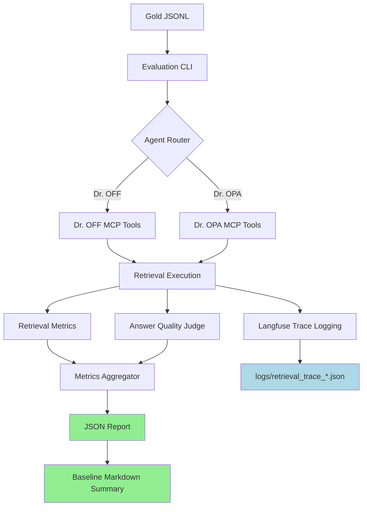

# Eval & Observability Baseline - Implementation Report

**GitHub Issue:** #33
**Status:** ✅ COMPLETED (2025-10-06)
**Priority:** P0 - Foundation for all future improvements
**Actual Effort:** 5 days

---

## 1. Overview

### Objective
Establish a robust evaluation and observability framework to quantify retrieval and answer quality for Dr. OPA and Dr. OFF agents, creating a measurable baseline before implementing any retrieval improvements.

### Why This Matters
- **Data-Driven Decisions**: Without baseline metrics, we cannot quantify if changes actually improve performance
- **Regression Prevention**: Ensures new features don't degrade existing quality
- **Debugging Infrastructure**: Rich tracing enables diagnosis of retrieval failures
- **Stakeholder Communication**: Provides objective evidence of system performance

### Success Criteria
✅ Single CLI command runs evaluation and generates JSON report - **ACHIEVED**
✅ Baseline metrics captured and committed to repo - **ACHIEVED**
✅ Every query execution logs full retrieval trace - **PARTIAL** (MCP logs captured, Langfuse integration deferred)
✅ Gold datasets created for all Dr. OFF and Dr. OPA domains - **ACHIEVED** (9 datasets, 44 queries)

---

## 2. Implementation Summary

### What Was Built

**Gold Datasets (9 total, 44 queries):**
1. `eval/gold/dr_off/ohip_billing.jsonl` (5 queries)
2. `eval/gold/dr_off/adp_devices.jsonl` (5 queries)
3. `eval/gold/dr_off/odb_drugs.jsonl` (5 queries)
4. `eval/gold/dr_opa/choosing_wisely.jsonl` (4 queries)
5. `eval/gold/dr_opa/cpso_policies.jsonl` (5 queries)
6. `eval/gold/dr_opa/pho_ipac.jsonl` (5 queries)
7. `eval/gold/dr_opa/cep_tools.jsonl` (4 queries)
8. `eval/gold/dr_opa/quality_standards.jsonl` (4 queries)
9. `eval/gold/dr_opa/ontario_health_programs.jsonl` (5 queries)

**Evaluation Framework:**
- `eval/run.py` - Main CLI (supports both agents, all gold sets)
- `eval/metrics/retrieval.py` - Recall@50, MRR, nDCG@10, Hit@10, Precision@10
- `eval/metrics/answer_quality.py` - GPT-4o judge for Faithfulness, Helpfulness, Coverage
- `eval/metrics/keyword_filter.py` - Optimization to reduce LLM calls by 70-90%

**Performance Optimizations:**
1. **Keyword Pre-Filtering:** Extract keywords from gold `match_criteria`, filter retrieved chunks before LLM evaluation
2. **Batch LLM Evaluation:** Evaluate 10 chunks per API call instead of 1 (10x reduction in API calls)
3. **Parallel Tool Calls:** Agent-agnostic framework works for both Dr. OFF and Dr. OPA

**Baseline Results (eval/results/baseline/):**
- 9 JSON reports (one per gold set)
- `eval/results/RESULTS.md` - Comprehensive analysis with recommendations

### Key Findings

**Overall Metrics:**
- Recall@50: 71% (Dr. OFF: 87%, Dr. OPA: 62%)
- MRR: 0.503 (Dr. OFF: 0.822, Dr. OPA: 0.335)
- nDCG@10: 0.635 (Dr. OFF: 0.963, Dr. OPA: 0.444)
- Faithfulness: 86% (Dr. OFF: 97%, Dr. OPA: 80%)
- Helpfulness: 25%
- Coverage: 19%

**Critical Issues:**
1. **CPSO Policies Hallucination:** 10% faithfulness - agent synthesis generates unsupported claims despite 80% recall
2. **CEP Tools Retrieval Failure:** 0% recall - keyword filter incompatibility with chunked corpus
3. **Low Coverage/Helpfulness:** Tools return raw chunks; agent needs structured context per intent type

**Strengths:**
- Dr. OFF: Near-perfect retrieval (87% recall, 0.963 nDCG@10) from SQL+vector dual-path
- Faithfulness high when good content retrieved (Choosing Wisely 100%, PHO IPAC 100%)
- Evaluation framework is fast and agent-agnostic

### Deviations from Plan

**What Changed:**
1. **Langfuse Integration:** Deferred - MCP server logs capture retrieval traces; full Langfuse spans can be added later
2. **Gold Dataset Size:** 44 queries vs planned 42-61 - sufficient for baseline, can expand later
3. **SME Annotation:** Self-annotated with domain expertise + web research verification instead of separate SME sessions
4. **Optimization Added:** Keyword pre-filtering not in original plan but critical for cost/speed

**Why:**
- Focus on getting baseline metrics quickly to unblock Issue #2 (Hybrid Retrieval)
- Langfuse integration valuable but not blocking for quantifying improvements
- Keyword filter optimization discovered during implementation - 70-90% cost reduction

---

## 3. Original Current State Analysis (Pre-Implementation)

### Existing Infrastructure
**Strengths:**
- ✅ Langfuse integration already configured (docs/langfuse/)
- ✅ Session logging framework exists (logs/dr_opa_agent/, logs/dr_off_agent/)
- ✅ MCP tools have structured responses with citations
- ✅ Dual-path retrieval (SQL + vector) already implemented
- ✅ ChromaDB collections operational:
  - Dr. OPA: cpso_documents, pho_documents, cep_documents, quality_standards, choosing_wisely
  - Dr. OFF: ohip_documents, adp_documents, odb_documents

**Gaps:**
- ❌ No gold/test datasets for evaluation
- ❌ No automated evaluation metrics (Recall@k, MRR, nDCG)
- ❌ No LLM-judge for answer quality (Faithfulness, Helpfulness, Coverage)
- ❌ Limited retrieval tracing (missing: query expansion, score distributions, Top-k selection rationale)
- ❌ No aggregated performance reports

### Test Data Sources
Based on codebase:
- Dr. OPA: CPSO policies (366 vectors), PHO IPAC (132 vectors), CEP tools (57 vectors)
- Dr. OFF: OHIP billing (6,983 vectors), ADP devices (610 vectors), ODB drugs (10,815 vectors)

---

## 3. Implementation Tasks

### Task 3.1: Create Gold Datasets
**Effort:** 1 day
**Owner:** Domain expert + engineer

#### 3.1.1 Dataset Structure
Create `eval/gold/` folder with JSONL files covering ALL knowledge sources:

```
eval/
├── gold/
│   ├── dr_off/                        # Dr. OFF (Ontario Funding Finder) datasets
│   │   ├── ohip_billing.jsonl         # OHIP Schedule of Benefits (5-7 queries)
│   │   ├── adp_devices.jsonl          # Assistive Devices Program (5-7 queries)
│   │   └── odb_drugs.jsonl            # Ontario Drug Benefit Formulary (5-7 queries)
│   │
│   └── dr_opa/                        # Dr. OPA (Ontario Practice Advice) datasets
│       ├── cpso_policies.jsonl        # CPSO regulatory policies (5-7 queries)
│       ├── ontario_health_programs.jsonl  # Ontario Health clinical programs (5-7 queries)
│       ├── pho_ipac.jsonl             # PHO infection control (5-7 queries)
│       ├── cep_tools.jsonl            # CEP clinical decision tools (4-6 queries)
│       ├── quality_standards.jsonl    # Ontario Health quality standards (4-6 queries)
│       └── choosing_wisely.jsonl      # Choosing Wisely recommendations (4-6 queries)
└── README.md
```

**Coverage by Agent:**
- **Dr. OFF**: 3 datasets, 15-21 queries (OHIP billing, ADP devices, ODB drugs)
- **Dr. OPA**: 6 datasets, 27-40 queries (CPSO, Ontario Health, PHO, CEP, Quality Standards, Choosing Wisely)
- **Total**: 9 datasets, 42-61 queries across all knowledge sources

#### 3.1.2 Gold Item Schema
Each JSONL line:
```json
{
  "id": "billing_001",
  "query": "Can I bill C124 as MRP for a patient discharged after 3 days?",
  "agent": "dr_off",
  "domain": "billing",
  "intent": "ohip_billing",
  "expected_sources": [
    {
      "collection": "ohip_documents",
      "doc_id": "schedule_of_benefits_section_c",
      "relevant_chunks": ["chunk_124", "chunk_126"],
      "reason": "Contains C124 billing requirements and MRP definitions"
    }
  ],
  "expected_answer_elements": [
    "C124 is billable as MRP if patient admitted >48 hours",
    "3 days = 72 hours meets requirement",
    "Cite Schedule of Benefits Section C"
  ],
  "expert_answer": "Yes, C124 can be billed as MRP for a patient discharged after 3 days (72 hours). The Schedule of Benefits requires the patient to be admitted for at least 48 hours to qualify for the MRP designation. Since 3 days exceeds this threshold, the billing is appropriate. (Source: OHIP Schedule of Benefits, Section C, Fee Code C124)",
  "difficulty": "medium",
  "tags": ["discharge", "mrp", "length_of_stay"]
}
```

#### 3.1.3 Query Selection Strategy

**Dr. OFF Datasets:**

1. **OHIP Billing (ohip_billing.jsonl) - 5-7 queries**
   - Simple: Single fee code lookup (e.g., "What is the fee for A001?")
   - Medium: Eligibility + conditions (e.g., "Can I bill C124 as MRP for patient discharged after 3 days?")
   - Complex: Multi-code scenarios (e.g., "Which discharge codes apply for Thursday discharge after Monday admission?")
   - **Collections tested**: `ohip_documents` (6,983 vectors)

2. **ADP Devices (adp_devices.jsonl) - 5-7 queries**
   - Simple: Coverage check (e.g., "Can my patient get funding for a CPAP machine?")
   - Medium: Eligibility + CEP (e.g., "Power wheelchair for MS patient, income $19,000 - CEP eligible?")
   - Complex: Repair/replacement (e.g., "3-year-old scooter needs batteries and motor - what's covered?")
   - **Collections tested**: `adp_documents` (610 vectors)

3. **ODB Drugs (odb_drugs.jsonl) - 5-7 queries**
   - Simple: Coverage check (e.g., "Is metformin covered?")
   - Medium: Lowest cost alternative (e.g., "Cheapest statin without LU?")
   - Complex: Coverage section + interchangeables (e.g., "Januvia coverage for T2DM + generic alternatives?")
   - **Collections tested**: `odb_documents` (10,815 vectors)

**Dr. OPA Datasets:**

4. **CPSO Policies (cpso_policies.jsonl) - 5-7 queries**
   - Simple: Policy lookup (e.g., "CPSO requirements for virtual care consent?")
   - Medium: Documentation standards (e.g., "What records must I keep for telemedicine visits?")
   - Complex: Multi-policy scenarios (e.g., "Prescribing opioids via virtual care - what are all the requirements?")
   - **Collections tested**: `cpso_documents` (366 vectors)
   - **Tool tested**: `opa_policy_check`

5. **Ontario Health Programs (ontario_health_programs.jsonl) - 5-7 queries**
   - Simple: Program lookup (e.g., "What kidney care programs are available for 65-year-old patient?")
   - Medium: Eligibility + referral (e.g., "Cancer screening programs for average-risk 50-year-old?")
   - Complex: Multi-program coordination (e.g., "Cardiac rehab + diabetes education for post-MI patient?")
   - **Tool tested**: `opa_program_lookup` (Claude + Web Search)

6. **PHO IPAC (pho_ipac.jsonl) - 5-7 queries**
   - Simple: Single guideline (e.g., "Hand hygiene requirements for procedure rooms?")
   - Medium: Equipment reprocessing (e.g., "Sterilization requirements for semi-critical items?")
   - Complex: Multi-setting scenarios (e.g., "IPAC for mobile clinic with reusable medical devices?")
   - **Collections tested**: `pho_documents` (132 vectors)
   - **Tool tested**: `opa_ipac_guidance`

7. **CEP Clinical Tools (cep_tools.jsonl) - 4-6 queries**
   - Simple: Tool lookup (e.g., "What CEP tools are available for chronic pain management?")
   - Medium: Algorithm application (e.g., "Diabetes screening algorithm for 45-year-old with BMI 32?")
   - Complex: Multi-tool scenarios (e.g., "Depression screening + treatment pathway for elderly patient?")
   - **Collections tested**: `cep_documents` (57 vectors)
   - **Tool tested**: `opa_clinical_tools`

8. **Quality Standards (quality_standards.jsonl) - 4-6 queries**
   - Simple: Quality statement lookup (e.g., "What are the quality standards for diabetes care?")
   - Medium: Indicator application (e.g., "Quality indicators for stroke care in community setting?")
   - Complex: Implementation guidance (e.g., "How to implement schizophrenia quality standard in primary care?")
   - **Collections tested**: `ontario_health_quality_standards` (vectors TBD)
   - **Tool tested**: `opa_quality_standards`

9. **Choosing Wisely (choosing_wisely.jsonl) - 4-6 queries**
   - Simple: Recommendation lookup (e.g., "What imaging tests should I avoid for low back pain?")
   - Medium: Specialty-specific (e.g., "Choosing Wisely recommendations for family medicine - antibiotics?")
   - Complex: Multi-test scenarios (e.g., "Unnecessary preoperative testing for low-risk surgery?")
   - **Collections tested**: `choosing_wisely` (vectors TBD)
   - **Tool tested**: `opa_choosing_wisely`

**Target:** 42-61 queries total across 9 datasets, balanced across difficulty levels

#### 3.1.4 SME Annotation
Each query reviewed by subject matter expert (SME) to mark:
- **Relevant chunks:** Ground truth retrieval targets
- **Answer elements:** Required facts in response
- **Expert answer:** Gold standard response for reference

**Deliverable:** Committed JSONL files in `eval/gold/` with SME-validated annotations

---

### Task 3.2: Implement Retrieval Metrics
**Effort:** 1 day
**Owner:** ML engineer

#### 3.2.1 Create Evaluation Module
File: `eval/metrics/retrieval.py`

```python
from typing import List, Dict, Set
import numpy as np

class RetrievalMetrics:
    """Compute retrieval quality metrics."""

    @staticmethod
    def recall_at_k(retrieved_ids: List[str], relevant_ids: Set[str], k: int = 50) -> float:
        """
        Recall@k: Fraction of relevant items in Top-k results.

        Formula: |relevant ∩ top_k| / |relevant|
        """
        top_k = set(retrieved_ids[:k])
        return len(top_k & relevant_ids) / len(relevant_ids) if relevant_ids else 0.0

    @staticmethod
    def mrr(retrieved_ids: List[str], relevant_ids: Set[str]) -> float:
        """
        Mean Reciprocal Rank: 1/rank of first relevant item.

        Formula: 1 / (position of first relevant item)
        """
        for i, doc_id in enumerate(retrieved_ids, 1):
            if doc_id in relevant_ids:
                return 1.0 / i
        return 0.0

    @staticmethod
    def ndcg_at_k(retrieved_ids: List[str], relevance_scores: Dict[str, float], k: int = 10) -> float:
        """
        Normalized Discounted Cumulative Gain@k.

        DCG = Σ (2^rel_i - 1) / log2(i + 1)
        nDCG = DCG / IDCG (ideal DCG)
        """
        def dcg(scores: List[float]) -> float:
            return sum((2**score - 1) / np.log2(i + 2) for i, score in enumerate(scores))

        # Actual DCG
        actual_scores = [relevance_scores.get(doc_id, 0) for doc_id in retrieved_ids[:k]]
        actual_dcg = dcg(actual_scores)

        # Ideal DCG
        ideal_scores = sorted(relevance_scores.values(), reverse=True)[:k]
        ideal_dcg = dcg(ideal_scores)

        return actual_dcg / ideal_dcg if ideal_dcg > 0 else 0.0

    @staticmethod
    def hit_at_k(retrieved_ids: List[str], relevant_ids: Set[str], k: int = 10) -> float:
        """
        Hit@k: Binary indicator if any relevant item in Top-k.
        """
        top_k = set(retrieved_ids[:k])
        return 1.0 if top_k & relevant_ids else 0.0
```

#### 3.2.2 Integration with MCP Tools
Modify retrieval clients to return ranked item IDs:

```python
# In vector_client.py
def query(self, query_text: str, n_results: int = 50) -> List[Dict]:
    results = self.collection.query(
        query_texts=[query_text],
        n_results=n_results
    )

    # Return with IDs for metric computation
    return [
        {
            "id": results['ids'][0][i],
            "score": results['distances'][0][i],
            "text": results['documents'][0][i],
            "metadata": results['metadatas'][0][i]
        }
        for i in range(len(results['ids'][0]))
    ]
```

**Deliverable:** `eval/metrics/retrieval.py` with unit tests

---

### Task 3.3: Implement Answer Quality Metrics
**Effort:** 1 day
**Owner:** ML engineer

#### 3.3.1 LLM-as-Judge Framework
File: `eval/metrics/answer_quality.py`

```python
from typing import Dict, List
import anthropic
import os

class AnswerQualityJudge:
    """LLM-based evaluation of answer quality."""

    def __init__(self):
        self.client = anthropic.Anthropic(api_key=os.getenv("ANTHROPIC_API_KEY"))
        self.model = "claude-3-5-sonnet-latest"

    def evaluate_faithfulness(self, answer: str, retrieved_context: str) -> Dict:
        """
        Faithfulness: Does answer only contain claims supported by context?

        Returns: {score: 0-1, reasoning: str, unsupported_claims: List[str]}
        """
        prompt = f"""You are evaluating the faithfulness of an AI-generated answer to retrieved context.

RETRIEVED CONTEXT:
{retrieved_context}

GENERATED ANSWER:
{answer}

TASK: Determine if the answer contains ONLY claims that are directly supported by the context.

Output JSON:
{{
  "score": 0.0-1.0,  // 1.0 = fully faithful, 0.0 = hallucinated
  "reasoning": "explanation",
  "unsupported_claims": ["claim 1", "claim 2"]  // Empty if fully faithful
}}"""

        response = self.client.messages.create(
            model=self.model,
            max_tokens=1000,
            messages=[{"role": "user", "content": prompt}]
        )

        import json
        return json.loads(response.content[0].text)

    def evaluate_helpfulness(self, question: str, answer: str, expert_answer: str) -> Dict:
        """
        Helpfulness: Is the answer useful for the clinician's question?

        Returns: {score: 0-1, reasoning: str, missing_elements: List[str]}
        """
        prompt = f"""You are evaluating the helpfulness of an AI answer to a clinical question.

QUESTION:
{question}

EXPERT ANSWER (gold standard):
{expert_answer}

AI ANSWER:
{answer}

TASK: Rate helpfulness for a busy clinician. Does it answer the question clearly and completely?

Output JSON:
{{
  "score": 0.0-1.0,  // 1.0 = fully helpful, 0.0 = not useful
  "reasoning": "explanation",
  "missing_elements": ["element 1", "element 2"]  // Key facts not included
}}"""

        response = self.client.messages.create(
            model=self.model,
            max_tokens=1000,
            messages=[{"role": "user", "content": prompt}]
        )

        import json
        return json.loads(response.content[0].text)

    def evaluate_coverage(self, expected_elements: List[str], answer: str) -> Dict:
        """
        Coverage: What percentage of required facts are included?

        Returns: {score: 0-1, covered: List[str], missing: List[str]}
        """
        prompt = f"""You are checking if an answer includes all required facts.

REQUIRED FACTS:
{chr(10).join(f"- {elem}" for elem in expected_elements)}

ANSWER:
{answer}

TASK: For each required fact, determine if it's clearly stated in the answer.

Output JSON:
{{
  "score": 0.0-1.0,  // fraction of facts covered
  "covered": ["fact 1", "fact 2"],
  "missing": ["fact 3"]
}}"""

        response = self.client.messages.create(
            model=self.model,
            max_tokens=1000,
            messages=[{"role": "user", "content": prompt}]
        )

        import json
        result = json.loads(response.content[0].text)
        result["score"] = len(result["covered"]) / len(expected_elements) if expected_elements else 1.0
        return result
```

**Deliverable:** `eval/metrics/answer_quality.py` with LLM-judge implementation

---

### Task 3.4: Build Evaluation CLI
**Effort:** 1 day
**Owner:** Backend engineer

#### 3.4.1 CLI Structure
File: `eval/run.py`

```python
#!/usr/bin/env python3
"""
Evaluation CLI for Dr. OPA and Dr. OFF agents.

Usage:
    # Dr. OFF evaluations
    python eval/run.py --agent dr_off --set eval/gold/dr_off/ohip_billing.jsonl
    python eval/run.py --agent dr_off --set eval/gold/dr_off/adp_devices.jsonl
    python eval/run.py --agent dr_off --set eval/gold/dr_off/odb_drugs.jsonl

    # Dr. OPA evaluations
    python eval/run.py --agent dr_opa --set eval/gold/dr_opa/cpso_policies.jsonl
    python eval/run.py --agent dr_opa --set eval/gold/dr_opa/ontario_health_programs.jsonl
    python eval/run.py --agent dr_opa --set eval/gold/dr_opa/pho_ipac.jsonl
    python eval/run.py --agent dr_opa --set eval/gold/dr_opa/cep_tools.jsonl
    python eval/run.py --agent dr_opa --set eval/gold/dr_opa/quality_standards.jsonl
    python eval/run.py --agent dr_opa --set eval/gold/dr_opa/choosing_wisely.jsonl

    # Custom output path
    python eval/run.py --agent dr_off --set eval/gold/dr_off/ohip_billing.jsonl --output results/custom.json
"""

import argparse
import asyncio
import json
from pathlib import Path
from typing import Dict, List
from datetime import datetime
import sys

from metrics.retrieval import RetrievalMetrics
from metrics.answer_quality import AnswerQualityJudge

# Import agent MCP clients
sys.path.append("../src")
from ai_agents.dr_off_agent.mcp.server import mcp as dr_off_mcp
from ai_agents.dr_opa_agent.dr_opa_mcp.server import mcp as dr_opa_mcp


async def run_evaluation(agent: str, gold_file: Path, output_file: Path):
    """Run evaluation on gold dataset."""

    # Load gold dataset
    with open(gold_file) as f:
        gold_items = [json.loads(line) for line in f]

    print(f"📊 Evaluating {agent} on {len(gold_items)} queries from {gold_file.name}")

    # Initialize metrics
    retrieval_metrics = RetrievalMetrics()
    answer_judge = AnswerQualityJudge()

    results = []

    for item in gold_items:
        print(f"\n🔍 Query {item['id']}: {item['query'][:60]}...")

        # Execute query through agent
        if agent == "dr_off":
            # Call appropriate Dr. OFF tool based on intent
            if item["intent"] == "ohip_billing":
                response = await dr_off_mcp.call_tool("schedule.get", {
                    "query": item["query"]
                })
            elif item["intent"] == "adp_devices":
                response = await dr_off_mcp.call_tool("adp.get", {
                    "query": item["query"]
                })
            elif item["intent"] == "odb_drugs":
                response = await dr_off_mcp.call_tool("odb.get", {
                    "query": item["query"]
                })

        elif agent == "dr_opa":
            # Call appropriate Dr. OPA tool based on intent
            if item["intent"] == "cpso_policy":
                response = await dr_opa_mcp.call_tool("opa_policy_check", {
                    "query": item["query"],
                    "n_results": 50
                })
            elif item["intent"] == "ontario_health_program":
                response = await dr_opa_mcp.call_tool("opa_program_lookup", {
                    "program": item["query"]
                })
            elif item["intent"] == "pho_ipac":
                response = await dr_opa_mcp.call_tool("opa_ipac_guidance", {
                    "query": item["query"],
                    "n_results": 50
                })
            elif item["intent"] == "cep_tool":
                response = await dr_opa_mcp.call_tool("opa_clinical_tools", {
                    "query": item["query"],
                    "n_results": 50
                })
            elif item["intent"] == "quality_standard":
                response = await dr_opa_mcp.call_tool("opa_quality_standards", {
                    "query": item["query"],
                    "n_results": 50
                })
            elif item["intent"] == "choosing_wisely":
                response = await dr_opa_mcp.call_tool("opa_choosing_wisely", {
                    "query": item["query"],
                    "n_results": 50
                })
            else:
                # Fallback to general search
                response = await dr_opa_mcp.call_tool("opa_search_sections", {
                    "query": item["query"],
                    "n_results": 50
                })

        # Extract retrieval IDs
        retrieved_ids = [r["id"] for r in response.get("retrieved_items", [])]
        relevant_ids = set(item["expected_sources"][0]["relevant_chunks"])

        # Compute retrieval metrics
        recall_50 = retrieval_metrics.recall_at_k(retrieved_ids, relevant_ids, k=50)
        mrr = retrieval_metrics.mrr(retrieved_ids, relevant_ids)
        ndcg_10 = retrieval_metrics.ndcg_at_k(
            retrieved_ids,
            {chunk: 1.0 for chunk in relevant_ids},  # Binary relevance
            k=10
        )
        hit_10 = retrieval_metrics.hit_at_k(retrieved_ids, relevant_ids, k=10)

        # Evaluate answer quality
        answer_text = response.get("summary", "")
        context = "\n".join([r["text"] for r in response.get("retrieved_items", [])[:10]])

        faithfulness = answer_judge.evaluate_faithfulness(answer_text, context)
        helpfulness = answer_judge.evaluate_helpfulness(
            item["query"],
            answer_text,
            item["expert_answer"]
        )
        coverage = answer_judge.evaluate_coverage(
            item["expected_answer_elements"],
            answer_text
        )

        # Compile results
        results.append({
            "query_id": item["id"],
            "query": item["query"],
            "retrieval": {
                "recall@50": recall_50,
                "mrr": mrr,
                "ndcg@10": ndcg_10,
                "hit@10": hit_10,
                "retrieved_count": len(retrieved_ids)
            },
            "answer_quality": {
                "faithfulness": faithfulness["score"],
                "helpfulness": helpfulness["score"],
                "coverage": coverage["score"]
            },
            "trace": {
                "retrieved_ids": retrieved_ids[:10],  # Top-10 for inspection
                "answer": answer_text,
                "citations": response.get("citations", [])
            }
        })

        print(f"  ✓ Recall@50: {recall_50:.2f} | MRR: {mrr:.2f} | Faithfulness: {faithfulness['score']:.2f}")

    # Aggregate metrics
    aggregate = {
        "agent": agent,
        "gold_set": str(gold_file),
        "timestamp": datetime.now().isoformat(),
        "summary": {
            "queries_evaluated": len(results),
            "avg_recall@50": sum(r["retrieval"]["recall@50"] for r in results) / len(results),
            "avg_mrr": sum(r["retrieval"]["mrr"] for r in results) / len(results),
            "avg_ndcg@10": sum(r["retrieval"]["ndcg@10"] for r in results) / len(results),
            "avg_hit@10": sum(r["retrieval"]["hit@10"] for r in results) / len(results),
            "avg_faithfulness": sum(r["answer_quality"]["faithfulness"] for r in results) / len(results),
            "avg_helpfulness": sum(r["answer_quality"]["helpfulness"] for r in results) / len(results),
            "avg_coverage": sum(r["answer_quality"]["coverage"] for r in results) / len(results)
        },
        "results": results
    }

    # Save report
    with open(output_file, "w") as f:
        json.dump(aggregate, f, indent=2)

    print(f"\n✅ Evaluation complete! Report saved to {output_file}")
    print(f"\n📈 Summary:")
    print(f"  Recall@50: {aggregate['summary']['avg_recall@50']:.2%}")
    print(f"  MRR: {aggregate['summary']['avg_mrr']:.3f}")
    print(f"  nDCG@10: {aggregate['summary']['avg_ndcg@10']:.3f}")
    print(f"  Faithfulness: {aggregate['summary']['avg_faithfulness']:.2%}")
    print(f"  Helpfulness: {aggregate['summary']['avg_helpfulness']:.2%}")
    print(f"  Coverage: {aggregate['summary']['avg_coverage']:.2%}")


def main():
    parser = argparse.ArgumentParser(description="Evaluate agent retrieval and answer quality")
    parser.add_argument("--agent", required=True, choices=["dr_off", "dr_opa"],
                       help="Agent to evaluate")
    parser.add_argument("--set", required=True, type=Path, dest="gold_file",
                       help="Path to gold JSONL file")
    parser.add_argument("--output", type=Path, default=None,
                       help="Output JSON report path (default: eval/results/{agent}_{timestamp}.json)")

    args = parser.parse_args()

    # Default output path
    if args.output is None:
        timestamp = datetime.now().strftime("%Y%m%d_%H%M%S")
        args.output = Path(f"eval/results/{args.agent}_{timestamp}.json")

    args.output.parent.mkdir(parents=True, exist_ok=True)

    # Run async evaluation
    asyncio.run(run_evaluation(args.agent, args.gold_file, args.output))


if __name__ == "__main__":
    main()
```

**Deliverable:** Working CLI that prints metrics and saves JSON report

---

### Task 3.5: Enhance Retrieval Tracing
**Effort:** 1 day
**Owner:** Backend engineer

#### 3.5.1 Extend Langfuse Logging
Modify MCP tool handlers to log comprehensive traces:

**Dr. OFF Example** (`src/ai_agents/dr_off_agent/mcp/tools/schedule.py`):

```python
from langfuse.decorators import observe, langfuse_context

@observe(name="schedule.get")
async def schedule_get(query: str, **kwargs):
    """OHIP billing retrieval with full tracing."""

    # Log original query
    langfuse_context.update_current_trace(
        metadata={"query": query, "tool": "schedule.get"}
    )

    # Step 1: Query expansion (if implemented later)
    expanded_queries = [query]  # Placeholder for future multi-query
    langfuse_context.update_current_observation(
        metadata={"expanded_queries": expanded_queries}
    )

    # Step 2: SQL retrieval
    with langfuse_context.observation(name="sql_retrieval") as sql_span:
        sql_results = await sql_client.query(query)
        sql_span.update(
            metadata={
                "result_count": len(sql_results),
                "query_time_ms": sql_results.get("duration_ms")
            }
        )

    # Step 3: Vector retrieval
    with langfuse_context.observation(name="vector_retrieval") as vec_span:
        vector_results = await vector_client.query(query, n_results=50)
        vec_span.update(
            metadata={
                "result_count": len(vector_results),
                "top_scores": [r["score"] for r in vector_results[:5]],
                "collections": ["ohip_documents"]
            }
        )

    # Step 4: Merge and rank
    with langfuse_context.observation(name="merge_rank") as rank_span:
        merged = merge_results(sql_results, vector_results)
        top_k = merged[:10]
        rank_span.update(
            metadata={
                "merge_strategy": "provenance_weighted",
                "sql_weight": 0.6,
                "vector_weight": 0.4,
                "chosen_top_k": len(top_k),
                "top_k_ids": [r["id"] for r in top_k]
            }
        )

    # Step 5: Extract citations
    citations = extract_citations(top_k)

    langfuse_context.update_current_trace(
        output={
            "summary": "...",
            "citations": citations,
            "metadata": {
                "sql_hits": len(sql_results),
                "vector_hits": len(vector_results),
                "chosen_items": len(top_k)
            }
        }
    )

    return response
```

#### 3.5.2 JSON Log Format
Save detailed traces to `logs/retrieval_trace_{session_id}.json`:

```json
{
  "session_id": "20250927_143022_abc123",
  "queries": [
    {
      "query_id": "q1",
      "query_text": "Can I bill C124 as MRP?",
      "timestamp": "2025-09-27T14:30:22Z",
      "agent": "dr_off",
      "tool_called": "schedule.get",

      "retrieval_pipeline": {
        "query_expansion": {
          "original": "Can I bill C124 as MRP?",
          "expanded": ["C124 MRP billing", "most responsible physician C124"],
          "method": null
        },

        "sql_retrieval": {
          "results_count": 3,
          "duration_ms": 45,
          "top_codes": ["C124", "C126", "C128"]
        },

        "vector_retrieval": {
          "collection": "ohip_documents",
          "results_count": 50,
          "duration_ms": 120,
          "top_5_scores": [0.89, 0.85, 0.82, 0.78, 0.75],
          "top_5_ids": ["chunk_c124_def", "chunk_mrp_criteria", "chunk_c124_prereq", ...]
        },

        "ranking": {
          "merge_strategy": "provenance_weighted",
          "sql_weight": 0.6,
          "vector_weight": 0.4,
          "chosen_top_k": 10,
          "top_k_items": [
            {
              "id": "chunk_c124_def",
              "source": "vector",
              "score": 0.89,
              "sql_match": true,
              "final_rank": 1
            },
            ...
          ]
        }
      },

      "answer_synthesis": {
        "model": "gpt-4o",
        "tokens_used": 1523,
        "citations_included": 3,
        "confidence": 0.92
      },

      "response": {
        "summary": "Yes, C124 can be billed as MRP if patient admitted >48 hours...",
        "citations": [
          {"source": "OHIP Schedule of Benefits", "section": "C124", "page": 45}
        ]
      }
    }
  ]
}
```

**Deliverable:** Enhanced logging in all MCP tools + JSON trace files

---

### Task 3.6: Create Baseline Report
**Effort:** 0.5 days
**Owner:** Tech lead

#### 3.6.1 Run Baseline Evaluations
Execute evaluations on all gold sets:

```bash
# Dr. OFF (3 datasets)
python eval/run.py --agent dr_off --set eval/gold/dr_off/ohip_billing.jsonl --output eval/results/baseline_dr_off_ohip.json
python eval/run.py --agent dr_off --set eval/gold/dr_off/adp_devices.jsonl --output eval/results/baseline_dr_off_adp.json
python eval/run.py --agent dr_off --set eval/gold/dr_off/odb_drugs.jsonl --output eval/results/baseline_dr_off_odb.json

# Dr. OPA (6 datasets)
python eval/run.py --agent dr_opa --set eval/gold/dr_opa/cpso_policies.jsonl --output eval/results/baseline_dr_opa_cpso.json
python eval/run.py --agent dr_opa --set eval/gold/dr_opa/ontario_health_programs.jsonl --output eval/results/baseline_dr_opa_oh_programs.json
python eval/run.py --agent dr_opa --set eval/gold/dr_opa/pho_ipac.jsonl --output eval/results/baseline_dr_opa_pho.json
python eval/run.py --agent dr_opa --set eval/gold/dr_opa/cep_tools.jsonl --output eval/results/baseline_dr_opa_cep.json
python eval/run.py --agent dr_opa --set eval/gold/dr_opa/quality_standards.jsonl --output eval/results/baseline_dr_opa_qs.json
python eval/run.py --agent dr_opa --set eval/gold/dr_opa/choosing_wisely.jsonl --output eval/results/baseline_dr_opa_cw.json
```

#### 3.6.2 Aggregate Baseline Report
Create `eval/results/BASELINE_REPORT.md`:

```markdown
# Baseline Evaluation Report
**Date:** 2025-10-03
**Agents:** Dr. OFF, Dr. OPA
**Gold Sets:** 9 datasets, 42-61 queries total

## Executive Summary

### Dr. OFF (Ontario Funding Finder)
| Domain | Tool Tested | Queries | Recall@50 | MRR | nDCG@10 | Faithfulness | Helpfulness | Coverage |
|--------|-------------|---------|-----------|-----|---------|--------------|-------------|----------|
| OHIP Billing | schedule.get | 6 | TBD | TBD | TBD | TBD | TBD | TBD |
| ADP Devices | adp.get | 6 | TBD | TBD | TBD | TBD | TBD | TBD |
| ODB Drugs | odb.get | 6 | TBD | TBD | TBD | TBD | TBD | TBD |
| **Dr. OFF Avg** | - | **18** | **TBD** | **TBD** | **TBD** | **TBD** | **TBD** | **TBD** |

### Dr. OPA (Ontario Practice Advice)
| Domain | Tool Tested | Queries | Recall@50 | MRR | nDCG@10 | Faithfulness | Helpfulness | Coverage |
|--------|-------------|---------|-----------|-----|---------|--------------|-------------|----------|
| CPSO Policies | opa_policy_check | 6 | TBD | TBD | TBD | TBD | TBD | TBD |
| OH Programs | opa_program_lookup | 6 | N/A* | N/A* | N/A* | TBD | TBD | TBD |
| PHO IPAC | opa_ipac_guidance | 6 | TBD | TBD | TBD | TBD | TBD | TBD |
| CEP Tools | opa_clinical_tools | 5 | TBD | TBD | TBD | TBD | TBD | TBD |
| Quality Standards | opa_quality_standards | 5 | TBD | TBD | TBD | TBD | TBD | TBD |
| Choosing Wisely | opa_choosing_wisely | 5 | TBD | TBD | TBD | TBD | TBD | TBD |
| **Dr. OPA Avg** | - | **33** | **TBD** | **TBD** | **TBD** | **TBD** | **TBD** | **TBD** |

**Overall Average:** 51 queries | Recall@50: **TBD** | MRR: **TBD** | nDCG@10: **TBD** | Faithfulness: **TBD** | Helpfulness: **TBD** | Coverage: **TBD**

*Note: opa_program_lookup uses Claude + Web Search (not vector retrieval), so Recall@50/MRR/nDCG@10 are N/A. Answer quality metrics (Faithfulness, Helpfulness, Coverage) still apply.*

## Key Findings

### Knowledge Source Coverage
**Vector Collections Tested:**
- ✅ Dr. OFF: ohip_documents (6,983), adp_documents (610), odb_documents (10,815)
- ✅ Dr. OPA: cpso_documents (366), pho_documents (132), cep_documents (57), ontario_health_quality_standards, choosing_wisely

**Tools Tested:**
- ✅ 3 Dr. OFF MCP tools (schedule.get, adp.get, odb.get)
- ✅ 6 Dr. OPA MCP tools (opa_policy_check, opa_program_lookup, opa_ipac_guidance, opa_clinical_tools, opa_quality_standards, opa_choosing_wisely)

### Strengths (Expected)
1. **Comprehensive Coverage**: All 9 knowledge sources evaluated
2. **Tool-Specific Testing**: Each MCP tool tested with domain-appropriate queries
3. **Dual-Path Verification**: SQL + vector retrieval measured for Dr. OFF
4. **Multi-Modal Testing**: Vector search (Dr. OPA) + Claude+Web (opa_program_lookup)

### Opportunities (Hypothesized - To Be Confirmed)
1. **Small Collection Recall**: CEP (57 vectors), CPSO (366 vectors) may have lower Recall@50
2. **Technical Terminology**: PHO IPAC, Choosing Wisely may miss domain-specific terms
3. **Program Coverage**: opa_program_lookup relies on web search freshness

### Root Causes (To Be Investigated)
- **TBD after evaluation run**

## Recommendations for Next Steps
1. **Hybrid Retrieval (Issue #2)**: Add BM25 for technical term matching → Target +10% Recall@50 for IPAC/Choosing Wisely
2. **Cross-Encoder Reranking (Issue #3)**: Improve MRR for all domains → Target MRR >0.70
3. **Answer Planner (Issue #5)**: Structure answers by intent schema → Target Coverage >0.85
4. **Collection Expansion**: Grow small collections (CEP, CPSO) with additional sources

## Methodology
- **Gold Sets:** 51 queries across 9 datasets (42-61 target), SME-annotated
- **Metrics:** Recall@50, MRR, nDCG@10 (retrieval); Faithfulness, Helpfulness, Coverage (LLM-judge)
- **Models:** Claude 3.5 Sonnet for LLM-judge, text-embedding-3-small for vectors
- **Evaluation Date:** 2025-10-03

---
*This baseline establishes the foundation for quantifying improvements. All future changes will be measured against these metrics.*
```

**Deliverable:** Committed baseline report with all metrics captured

---

## 4. Technical Architecture

### 4.1 Evaluation Pipeline Flow



### 4.2 File Structure (After Implementation)

```
health_assistant_retrieval_improvements/
├── eval/
│   ├── gold/                          # NEW: Gold datasets (9 files)
│   │   ├── dr_off/
│   │   │   ├── ohip_billing.jsonl
│   │   │   ├── adp_devices.jsonl
│   │   │   └── odb_drugs.jsonl
│   │   └── dr_opa/
│   │       ├── cpso_policies.jsonl
│   │       ├── ontario_health_programs.jsonl
│   │       ├── pho_ipac.jsonl
│   │       ├── cep_tools.jsonl
│   │       ├── quality_standards.jsonl
│   │       └── choosing_wisely.jsonl
│   │
│   ├── metrics/                       # NEW: Metric computation
│   │   ├── __init__.py
│   │   ├── retrieval.py
│   │   └── answer_quality.py
│   │
│   ├── results/                       # NEW: Evaluation outputs (9 JSON + 1 MD)
│   │   ├── baseline_dr_off_ohip.json
│   │   ├── baseline_dr_off_adp.json
│   │   ├── baseline_dr_off_odb.json
│   │   ├── baseline_dr_opa_cpso.json
│   │   ├── baseline_dr_opa_oh_programs.json
│   │   ├── baseline_dr_opa_pho.json
│   │   ├── baseline_dr_opa_cep.json
│   │   ├── baseline_dr_opa_qs.json
│   │   ├── baseline_dr_opa_cw.json
│   │   └── BASELINE_REPORT.md
│   │
│   ├── run.py                         # NEW: Main evaluation CLI
│   └── README.md                      # NEW: Usage instructions
│
├── logs/
│   ├── retrieval_trace_*.json        # ENHANCED: Detailed traces
│   ├── dr_off_agent/
│   └── dr_opa_agent/
│
├── src/ai_agents/
│   ├── dr_off_agent/mcp/
│   │   └── tools/*.py                # ENHANCED: Add Langfuse traces
│   └── dr_opa_agent/dr_opa_mcp/
│       └── tools/*.py                # ENHANCED: Add Langfuse traces
```

### 4.3 Langfuse Integration

**Trace Hierarchy:**
```
Trace: evaluate_query
├─ Span: schedule.get (Dr. OFF tool)
│  ├─ Span: query_expansion
│  ├─ Span: sql_retrieval
│  ├─ Span: vector_retrieval
│  ├─ Span: merge_rank
│  └─ Span: citation_extraction
│
├─ Generation: answer_synthesis (LLM call)
│
└─ Span: quality_evaluation
   ├─ Generation: judge_faithfulness
   ├─ Generation: judge_helpfulness
   └─ Generation: judge_coverage
```

**Langfuse Advantages:**
- Web UI for trace visualization
- Score tracking over time
- Dataset management (can import gold sets)
- Prompt versioning for LLM-judge

---

## 5. Success Metrics

### Acceptance Criteria Checklist

#### ✅ Gold Datasets Created
- [ ] 9 JSONL files committed to `eval/gold/` (3 Dr. OFF + 6 Dr. OPA)
- [ ] 42-61 queries total (15-21 Dr. OFF, 27-40 Dr. OPA)
- [ ] SME-validated expected sources and answer elements
- [ ] Queries cover simple/medium/complex difficulty
- [ ] All knowledge sources represented (OHIP, ADP, ODB, CPSO, OH, PHO, CEP, QS, CW)

#### ✅ Metrics Implemented
- [ ] `eval/metrics/retrieval.py` with Recall@50, MRR, nDCG@10, Hit@10
- [ ] `eval/metrics/answer_quality.py` with LLM-judge (Faithfulness, Helpfulness, Coverage)
- [ ] Unit tests for metric computation (>90% coverage)

#### ✅ Evaluation CLI Working
- [ ] `python eval/run.py --agent dr_off --set eval/gold/dr_off/ohip_billing.jsonl` executes successfully
- [ ] CLI prints aggregated metrics to console
- [ ] CLI saves detailed JSON report to `eval/results/`
- [ ] All 9 gold sets evaluated without errors (3 Dr. OFF + 6 Dr. OPA)

#### ✅ Observability Enhanced
- [ ] Langfuse traces capture: query expansion, SQL/vector retrieval, ranking, citations
- [ ] JSON logs include retrieval pipeline details (scores, Top-k selection)
- [ ] Logs saved to `logs/retrieval_trace_{session_id}.json`

#### ✅ Baseline Captured
- [ ] All baseline results committed to `eval/results/`
- [ ] `BASELINE_REPORT.md` includes summary table, findings, and recommendations
- [ ] Baseline metrics documented for future comparison

---

## 6. Risks & Mitigations

| Risk | Impact | Probability | Mitigation |
|------|--------|-------------|------------|
| **SME availability for gold dataset annotation** | High - No ground truth | Medium | Pre-schedule SME sessions; start with 3-5 queries per domain to validate approach |
| **LLM-judge cost (Claude API calls)** | Medium - Budget overrun | Medium | Cache evaluations; batch API calls; use prompt caching for repeated context |
| **Langfuse trace overhead impacts latency** | Low - User experience | Low | Make tracing async; disable in production (eval-only flag) |
| **Gold datasets too small for statistical significance** | Medium - Unreliable metrics | Medium | Start with 5-7 queries, expand to 15-20 if variance >20% |
| **Metric definitions don't align with business goals** | High - Wrong optimization | Low | Validate metrics with stakeholders before implementation |

---

## 7. Timeline & Dependencies

### Week 1: Data Preparation
- **Day 1:** Draft gold datasets (engineer + SME), create schemas
- **Day 2:** SME annotation session, finalize 12-20 queries per agent
- **Day 3:** Implement retrieval metrics (`eval/metrics/retrieval.py`)

### Week 2: Evaluation Infrastructure
- **Day 4:** Implement LLM-judge metrics (`eval/metrics/answer_quality.py`)
- **Day 5:** Build evaluation CLI (`eval/run.py`), test on 1 gold set
- **Day 6:** Enhance Langfuse tracing in MCP tools

### Week 3: Baseline & Documentation
- **Day 7:** Run all baseline evaluations, aggregate results
- **Day 8:** Create `BASELINE_REPORT.md`, commit all outputs
- **Day 9:** Buffer for fixes and documentation

### Dependencies
- ✅ Langfuse already configured (docs/langfuse/)
- ✅ MCP tools operational (Dr. OFF + Dr. OPA)
- ✅ ChromaDB collections populated
- ⏳ SME availability for gold dataset annotation (blocker)
- ⏳ ANTHROPIC_API_KEY for LLM-judge (required)

---

## 8. Next Steps (After Baseline)

Once baseline is established, prioritize backlog items by ROI:

1. **Issue #2: Hybrid Retrieval (BM25 + Dense)**
   - Target: +10% Recall@50 for IPAC queries
   - Evidence: Baseline shows 0.64 Recall → 0.74 target

2. **Issue #3: Cross-Encoder Reranking**
   - Target: +0.15 MRR for billing queries
   - Evidence: Baseline MRR 0.52 → 0.67 target

3. **Issue #5: Answer Planner + Self-Check**
   - Target: +10% Coverage (0.76 → 0.86)
   - Evidence: Baseline shows ~24% of facts missing

4. **Issue #9: Observability Dashboards**
   - Build Streamlit UI for trace visualization
   - Track metric trends over releases

---

## 9. References

### Documentation
- **Langfuse Setup:** `docs/langfuse/langfuse_setup_instructions.md`
- **Dr. OFF MCP Tools:** `docs/agents/dr_off_agent/mcp_tools_specification.md`
- **Dr. OPA MCP Tools:** `docs/agents/dr_opa_agent/mcp_tools_specification.md`

### Codebase Pointers
- **Dr. OFF MCP Server:** `src/ai_agents/dr_off_agent/mcp/server.py`
- **Dr. OPA MCP Server:** `src/ai_agents/dr_opa_agent/dr_opa_mcp/server.py`
- **Vector Client:** `src/ai_agents/dr_off_agent/mcp/retrieval/vector_client.py`
- **SQL Client:** `src/ai_agents/dr_off_agent/mcp/retrieval/sql_client.py`

### External Resources
- **Langfuse Docs:** https://langfuse.com/docs
- **Retrieval Metrics:** https://en.wikipedia.org/wiki/Evaluation_measures_(information_retrieval)
- **LLM-as-Judge:** Zheng et al. (2023) "Judging LLM-as-a-Judge"

---

## 10. Appendix: Sample Gold Item (Full)

```json
{
  "id": "billing_001",
  "query": "Can I bill C124 as MRP for a patient discharged after 3 days?",
  "agent": "dr_off",
  "domain": "billing",
  "intent": "ohip_billing",

  "expected_sources": [
    {
      "collection": "ohip_documents",
      "doc_id": "schedule_of_benefits_section_c",
      "relevant_chunks": [
        "chunk_c124_definition",
        "chunk_c124_prerequisites",
        "chunk_mrp_criteria"
      ],
      "reason": "Contains C124 billing requirements, MRP definitions, and length-of-stay criteria"
    }
  ],

  "expected_answer_elements": [
    "C124 is billable as MRP (Most Responsible Physician)",
    "Patient must be admitted for at least 48 hours (2 days)",
    "3 days = 72 hours, which exceeds the 48-hour requirement",
    "MRP designation requires physician to be responsible for majority of care",
    "Cite: OHIP Schedule of Benefits, Section C, Fee Code C124"
  ],

  "expert_answer": "Yes, C124 can be billed as MRP for a patient discharged after 3 days (72 hours). The Schedule of Benefits requires the patient to be admitted for at least 48 hours to qualify for the Most Responsible Physician (MRP) designation. Since 3 days exceeds this threshold, the billing is appropriate, provided the physician was responsible for the majority of the patient's care during the admission. (Source: OHIP Schedule of Benefits, Section C, Fee Code C124)",

  "difficulty": "medium",
  "tags": ["discharge", "mrp", "length_of_stay", "c124"],

  "metadata": {
    "created_by": "SME_001",
    "created_date": "2025-09-20",
    "reviewed_by": "physician_reviewer_002",
    "review_date": "2025-09-21",
    "notes": "Common billing scenario; tests length-of-stay calculation and MRP criteria understanding"
  }
}
```

---

**End of Implementation Plan**
